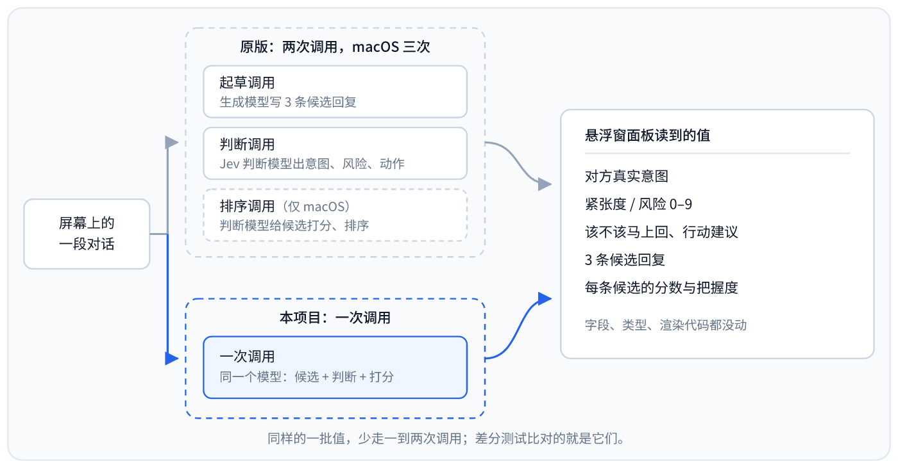

<div align="center">

# chat-nojev

**同一个对话副驾，把两次模型调用并成一次：判断和候选回复出自同一个模型、同一次请求，你只配一把 key。**

[](LICENSE)
[](#windows)
[](#android)
[](#macos)
[](#与-jev-chat-的等价)
[](#它把什么并成了一次)

<!-- 构建徽章放这里：等 .github/workflows 落地后再加。现在没有工作流，不挂一个必然是红的徽章。 -->
[](https://github.com/chy4pro/chat-nojev/actions/workflows/test.yml)

[它改了什么](#它把什么并成了一次) · [快速开始](#快速开始) · [差分测试](#与-jev-chat-的等价) · [Windows 变体](windows/) · [Android 变体](android/) · [macOS 变体](macos/) · [jev-chat](https://github.com/jev-chat) · [NOTICE](NOTICE)

</div>

## 它把什么并成了一次

jev-chat 的链路是两段：生成模型起草 3 条候选回复，专门的判断模型（TypeSafe Jev）回答对方的真实意图、紧张度、该不该马上回；macOS 上还要再来一次，让判断模型给候选打分排序。两路接口、两把 key。

这一版只发一次请求。同一个模型写候选、答那几道判断题、给每条候选打分，一个 JSON 回来。题面原文、选项集合、0–9 的紧张度档位都是从它原样搬过来的，**换的只是产出方**；悬浮窗读到的字段、类型和渲染那段代码一行没动。

<div align="center">



</div>

## 为什么这么改

- **少一把 key。** jev-chat 要判断和起草两路接口各配一把；这里只有一把，配置页也就少了一整节。
- **少一次把整段对话发出去。** 判断调用要把同一段对话再发一遍。现在发一次。
- **判断题一个字没改。** 7 道题（macOS 是它自己的 2 道）、选项 key 和描述、0–9 的档位都照搬原版，仍然框着这道题该怎么答。
- **下游代码没动，而且有东西盯着。** 每个变体都带一套差分测试，把同一批场景同时喂给它那棵树和这一棵，逐字段比对处理结果；每套都自带负控——故意改坏一处、必须变红。
- **它的边界原样保留。** 只读你自己屏幕上的对话，不 hook、不改包、不解密数据库，只把回复填进输入框，发送键永远你自己按。这几条是它的设计，这一版没有碰。
- **代价是明写的。** `confidence` / `probabilities` 现在是模型的自评而不是校准过的概率；macOS 那个不用联网、只在本地跑的判断模型也被删掉了——这不是丢了离线能力（起草那次调用本来就要联网，App 从没能离线用过），丢的是隐私：判断的内容原来可以不出这台机器，现在跟起草一起出网了。都在[合并掉了什么](#合并掉了什么)。

**判断会不会变差，这里给个论证，不是量出来的结论。** 那几道题问的是开放的社会判断——对方到底想说什么、该不该马上接、这句话有多紧张。通用模型读这类东西，比只能从一张固定标签表里选一个的小分类器更合适，而且现在不再被关在那张表里：它可以直接用对话原本的语言作答。题面没有改——原文、选项集合、0–9 的档位都照原样保留，牵着模型走的还是那套为旧模型调出来的措辞。判断和候选也不再是互相看不见的两个意见：原来起草是单独一次调用，盲写三条，看不到判断会给出什么结论（见 `windows/core/draft.py` 里的说明）；现在一次调用两样都出，回复和判断出自对同一段对话的同一次读法。

分类器只能从一个封闭集合里选，答案不在里面也得硬凑一个最接近的。Windows / Android 那三道 choice 题的选项分别是 6、7、5 个，macOS 的意图题是 8 个——遇到题面没预料到的说法，macOS 原版的判断层会直接退回默认标签「闲聊」，没有「都不是」这个选项。通用模型不受这个限制：它用一句自己的话作答，用的是对话原本的语言，题面之外的说法不用被抹成最接近的那个标签。选项表还留在提示词里，所以常见情况回来的还是那几个熟悉的说法——这份自由只在选项表原来会逼它说错话的地方才用得上：该准的地方更准，其余地方不变。也是因为这样，面板不再需要那张把英文 key 翻成中文的对照表：原来的判断模型只能吐一个英文 key，翻译表才有存在的理由；现在模型直接写短语，翻译表没活可干，前面也提过这处改动，根子就在这里。

速度上，省的不只是「两三次变一次」。排序本来就没法在候选写完之前开始——没有候选可排。这个串行等待三处都有：Windows 先盲写候选，再把候选连同对话交给判断模型去判并排序；Android 的候选那条路先起草，写完才把候选连同对话再发一次给判断模型排序；macOS 判断和起草并行，但排序是第三次调用，要等每种话术都生成完才发得出去。合并把这段等待去掉了。

代价也在这儿：`confidence` 和候选的排序分原来是训练出来干这件事的分类器给的校准输出，现在是模型的自评。Android 和 macOS 的面板确实把它显示成百分比（「把握」「识别率」），但代码里没有地方拿这两个数做阈值判断，只当参考顺序展示；真要有谁拿它卡逻辑，才会踩到「不是校准过的概率」这一点。

以上是两种设计的差异推出来的判断，不是拿真实模型跑出来的结果——这个仓库没有量过判断准确率。

## 三个变体

三份代码不是同一个东西的三次移植：Windows 和 Android 问的是同一套 7 道判断题，macOS 问的是它自己的两道（8 类意图 + 0–9 风险），候选按话术分组生成。所以「合并」这件事在三处的做法和代价都不一样。

| 变体 | 来自 | 采集方式 | 原版的调用 | 这一版 | 配置 | 差分结果 |
|---|---|---|---|---|---|---|
| [`windows/`](windows/) | [jev-chat-windows](https://github.com/jev-chat/jev-chat-windows) | 微信 Windows 4.x 窗口截图 + 本地离线 OCR | 起草 1 + 判断 1 | **1 次** | 一把 key | 15 个场景全一致 |
| [`android/`](android/) | [jev-chat-jarvis](https://github.com/jev-chat/jev-chat-jarvis)（最早的那一版） | 无障碍读气泡节点，飞书等走 ML Kit 离线 OCR | 判断 1 + 起草 1 + 排序 1（分属两路接口） | **1 次** | 「模型接口」一把 key | 16 个场景全一致 |
| [`macos/`](macos/) | [jev-chat-jarvis-mac](https://github.com/jev-chat/jev-chat-jarvis-mac) | 抓微信窗口 + Vision OCR | 判断 1 + 排序 1 + 每个话术一次生成 | **每个话术一次生成** | 一把 key | 16 个场景 11 一致、5 处已记录分歧 |

各自的完整比对写在 [`windows/docs/EQUIVALENCE.md`](windows/docs/EQUIVALENCE.md)、[`android/docs/EQUIVALENCE.md`](android/docs/EQUIVALENCE.md)、[`macos/docs/EQUIVALENCE.md`](macos/docs/EQUIVALENCE.md)。

## 快速开始

**先说清楚现在是什么状态：三个变体今天各发了 `v0.1.0`，由仓库自己的 workflow 在 GitHub 的 runner 上编译、打包、发布——但没有一个在真实设备上跑过。** 这台机器上没有 Android SDK、没有 Mac、也没有能显示 PySide6 窗口的桌面，CI 证明的只是「编译得过、打得出包」，不是「装上能用」。谁装谁就是第一个试的人。跑过并且反复跑的是下面那三套差分测试。

### Windows

**[下载 windows-v0.1.0](https://github.com/chy4pro/chat-nojev/releases/tag/windows-v0.1.0)** —— `jev-chat-windows-v0.1.0.zip`（165.5 MB）。解压到一个固定目录，双击里面的 `jev-chat-windows.exe`。这是 PyInstaller 的 onedir 打包，体积大是因为整个文件夹里带着离线 OCR 模型和 Qt；exe 没签名，SmartScreen 会拦一下，「更多信息」→「仍要运行」。

要求 Windows 10 1903+ / 11、微信 Windows 4.x。首次启动弹设置页，「模型」卡片只有一节（jev-chat-windows 是判断、起草两节）：填一把 OpenAI 兼容端点的 key，选你们的关系，保存。key 进 Windows 用户环境变量 `LLM_API_KEY`（注册表 `HKCU\Environment`），不落文件；其余设置写 `config.json`。

**从源码跑**

```bash
git clone https://github.com/chy4pro/chat-nojev.git
cd chat-nojev/windows
python -m venv .venv
.venv\Scripts\activate
pip install -r requirements.txt
python main.py
```

自己打包是 `build.bat` / `pyinstaller --noconfirm --clean jev.spec`；上面那个 zip 就是推 `windows-v0.1.0` 这个 tag 后 `.github/workflows/release-windows.yml` 在 `windows-latest` 上跑出来、原样挂到 Release 的，本仓库自己没有在真机上装过跑过。

### Android

**[下载 android-v0.1.0](https://github.com/chy4pro/chat-nojev/releases/tag/android-v0.1.0)** —— `jev-chat-android-v0.1.0-unsigned.apk`（24.5 MB，另附 `.sha256`）。**这个 APK 没有签名**：仓库没配签名密钥，CI 就只能出未签名包。没签名意味着**它装不上**：安卓要求每个 APK 都带一个有效签名，这跟「允许未知来源」是两回事——后者管的是允不允许从商店以外的地方装，签名是任何来源都绕不过的一道。要装得先自己签一次（`apksigner sign --ks 你的.jks --out signed.apk jev-chat-android-v0.1.0-unsigned.apk`），Release 页上有同样的说明。安卓的签名是自签的，不需要任何机构审核，`keytool` 生成一把就行。这个包用了自己的 application id（`com.jev.probe.nojev`）和自己的启动器名字（对话副驾），所以是**装在 `jev-chat-jarvis` 旁边，不是替换它**——这正是目的：两个能同时留在一台手机上互相比着看。

装上之后：设置 →「接口」只有两张卡（模型 / 视觉），填「模型接口」一把 key 就能用，视觉留空自动继承它。权限还是它那三项——无障碍、悬浮窗、自启动 + 省电无限制。

**从源码打包**

```bash
cd android
./gradlew assembleDebug     # app/build/outputs/apk/debug/app-debug.apk
```

JDK 17 + Android SDK（platform 35 / build-tools 35）。上面 Release 里那个未签名 APK 就是推 `android-v0.1.0` 这个 tag 后 `.github/workflows/release-android.yml` 在 GitHub 自带 SDK 的 Linux runner 上用 `assembleRelease` 打出来的；`apk/` 目录没有从 jev-chat-jarvis 复制过来，它自己 Releases 里签好名的包是原版那一份，不含这里的改动。

### macOS

**[下载 macos-v0.1.0](https://github.com/chy4pro/chat-nojev/releases/tag/macos-v0.1.0)** —— `jev-jarvis-macos-v0.1.0.zip`（0.1 MB，同一个 Release 下还有别名 `jev-jarvis-macos-latest.zip` 和一份 `SHA256SUMS`）。zip 这么小不是漏打包：它只是个小启动器，首次运行时再联网拉自己的 Python 依赖，这是原版自己的设计，这一版没有改动它。没有代码签名、也没有公证，Gatekeeper 会在第一次打开时拦下来：右键（或按住 Control 点）→ 打开 → 再点一次「打开」；如果提示「已损坏，无法打开」，在终端跑：

```bash
xattr -d com.apple.quarantine /Applications/jev-jarvis.app
```

构建 runner 是 Apple Silicon（arm64）。

要求 macOS 13+，微信在运行，终端已授予「屏幕录制」；「填入」另需「辅助功能」。配置是一个 env 文件，只有一把 key：

```bash
mkdir -p ~/.config/jev-jarvis
cat > ~/.config/jev-jarvis/env <<'ENV'
export OPENAI_API_KEY="sk-你的key"
export OPENAI_BASE_URL="https://api.deepseek.com"
export OPENAI_MODEL="deepseek-chat"
ENV
chmod 600 ~/.config/jev-jarvis/env
```

不配 key 就什么都没有：jev-chat-jarvis-mac 那条「判断层不填 key 就走本地 decider-2b」的路在这一版被删掉了，判断从此也要跟着起草一起联网。

**从源码跑**

```bash
cd macos
./start.command
```

打包是 `packaging/build_app.sh`（发布走 `packaging/release.sh`）；上面那个 zip 就是推 `macos-v0.1.0` 这个 tag 后 `.github/workflows/release-macos.yml` 在 `macos-latest` 上跑出来的，本仓库自己没有 Mac 去装它、跑它。

## 与 jev-chat 的等价

### 标准

要求**不是**中间数据和 jev-chat 逐字节一样，而是**同一段下游代码对它的处理结果一样**：`core/engine.py` + `app/overlay.py`（Windows）、`OverlayController.render()`（Android）、`src/hud.py`（macOS）从这一版的一次调用里得到的，必须和它们从原版的两三次调用里得到的一样。

这是个更弱的要求，也是对的那个。它的下游代码本来就得扛住判断模型回垃圾，所以它在用的时候才校验：一个不在分类表里的标签本来就显示成标签本身，一个超出 0..9 的紧张度原版就是显示成「危险 11/9」。**适配层只做翻译，就翻译到这里为止**——再校验一遍不是保护，是改行为：把 11 夹回 9，显示的东西就跟原版不一样了。模型压根没给的值就留空，不替它编一个。

### 跑一遍

```bash
python tools/equivalence_check.py         --upstream /path/to/jev-chat-windows
python tools/equivalence_check_macos.py   --upstream /path/to/jev-chat-jarvis-mac
bash   tools/equivalence_check_android.sh --upstream /path/to/jev-chat-jarvis --probe /path/to/toolchain
```

每套都把场景写成一份中立数据，再渲染成两种线上格式——给 jev-chat 的是判断接口的 `answers`，给这一版的是合并后的那个 JSON——两边各起一个进程跑真实代码，逐字段比对。它只在自己的起草和判断调用处打桩，这一版只在 HTTP 调用处打桩，所以我们的解析器和适配层是拿着模型原始字符串真跑的。

Android 那套要 JDK 和 kotlinc，**不要 Android SDK**：参与编译的文件除了三个 Android 类型（`Rect` / `Log` / `Context`）之外不碰框架，那三个由五十行手写桩顶上。

负控（故意改坏、必须变红）：

| 变体 | 负控 | 结果 |
|---|---|---|
| `windows/` | 把 `_REPLY_IDX` 反过来 | 15 个里 14 个红 |
| `android/` | `--negative-control keys`：reply 键顺序倒过来 | 16 个里 15 个红（剩下那个所有分都是 0，顺序本来就无所谓） |
| `android/` | `--negative-control clamp`：适配层把紧张度夹回 0..9 | `score_out_of_range` 红，其余不动 |
| `macos/` | 适配层把 risk 夹进 0..9 | `risk_outside_its_range` 红 |
| `macos/` | 组内排序键取反 | 16 个里 15 个红 |

### 一次真实运行

下面是 Android 那套在这个容器里跑出来的原始输出（对照的是 jev-chat-jarvis）。最后几行是重点：同一个场景，它打三次接口，这边打一次。

```
--- 编译 upstream（/tmp/claude-1000/-work-jev-apps/86ea61c1-fe18-48cb-aa76-ef7e1fa1ba47/scratchpad/chat/jev-chat-jarvis）
--- 编译 ours（/work/chat-nojev/android）

--- 跑两边（各自一个 JVM）
[upstream] 写出 /tmp/tmp.tpUkDLGUdt/up.json
[ours] 写出 /tmp/tmp.tpUkDLGUdt/ours.json

场景                            结果   说明
----------------------------------------------------------------------------------------------
ordinary_three_candidates       PASS   普通情况：三条候选，赢家清楚
winner_not_top_scorer           PASS   点名的不是分最高的那条：两边都只按分排序
winner_is_reply_a               PASS   赢家是第一条：验键到下标的映射
winner_is_reply_c               PASS   赢家是第三条：验键到下标的映射
two_candidates_only             PASS   模型只给两条：两边都补足三条（占位文案相同）
boundary_values_low             PASS   边界值：danger_level 0，noul 全 0.0
boundary_values_high            PASS   边界值：danger_level 9，noul 全 1.0
ranking_block_missing           PASS   排序整块都没有：两边都全记 0、顺序不动
choice_names_missing_candidate  PASS   点名的候选不存在（只有两条却点 reply_c）
probabilities_not_normalized    PASS   分加起来不是 1：两边都原样递下去
score_out_of_range              PASS   紧张度 11（题目只有 0..9）：不夹范围，原样递下去
intent_outside_taxonomy         PASS   题目里没有的说法：不查表，原样递下去
judgment_field_absent           PASS   两边都缺同一个判断字段（best_action）
confidence_omitted              PASS   判断字段不给 confidence（判断模型一定给，通用模型常常漏）
noul_as_bare_number             PASS   我们这边 noul 写成裸数字 / true-false，必须等价于 {"noul": x}
score_legend_from_api           PASS   jev-chat-jarvis 那边带 legend（接口就是这么回的），我们没有：档数必须一样
----------------------------------------------------------------------------------------------
共 16 个场景：16 完全一致，0 有已知分歧，0 失败

每个场景的接口调用（证明没打网络，也证明调用次数变了）:
    ordinary_three_candidates: jev-chat-jarvis ["判断接口","回复接口","判断接口"] / 我们 ["回复接口"]
    winner_not_top_scorer: jev-chat-jarvis ["判断接口","回复接口","判断接口"] / 我们 ["回复接口"]
    winner_is_reply_a: jev-chat-jarvis ["判断接口","回复接口","判断接口"] / 我们 ["回复接口"]

latencyMs 不参与比对（墙上时间，不是任何一边算出来的值）。
```

Windows 那套 15 个场景全一致（`usage` 不参与比对：jev-chat-windows 报判断接口的 token 计数，这一版的 `core/llm.chat()` 只回文本）。macOS 那套 16 个里 11 个一致、5 个是下面这五处。

### macOS 的五处分歧

这五处是同一个决定的五次现身：**jev-chat-jarvis-mac 的判断层在把答案交出去的路上悄悄改过它，这一版不改。**

Windows 和 Android 的下游代码本来就硬，适配层可以原样递过去；macOS 的硬化写在判断适配器自己身上（`JevJudge.judge` 里的查表兜底、`float(... or 0.0)`、`ACTION_MAP` 查表），面板那边没有任何防护。所以要么适配层继续替模型做主，要么把防护挪到用的地方。**挪了**——`src/hud.py` 长出四个只管自己那一行的读取函数。

| 场景 | jev-chat-jarvis-mac | 这一版 |
|---|---|---|
| `intent_outside_the_taxonomy` | 落回「闲聊」，`actions` 跟着查表 | 显示模型写的那句话，配它自己写的行动建议 |
| `intent_is_an_empty_string` | `"" or "闲聊"` → 闲聊 | 「暂未判断」；不替它编 |
| `risk_not_a_number` | `0.0` → 面板显示「● 安全 0/9」 | 原样递下去 → 「风险待判断」。模型没给的值，说「安全」比说「不知道」更糟 |
| `confidence_omitted` | `float(None or 0.0)` → 「意图识别率 0%」 | 键缺席，这一行留空 |
| `judgment_fails_entirely_generation_succeeds` | 排序跟判断一起死（同一个模型），每条候选的 `prob` 永远是 `None`，行上一直写着「排序中」 | 分数是跟候选一起回来的，判断挂了排序照样在 |

前四条是那个决定，第五条是合并顺手带来的好处。两边都不夹范围：它对 11 分的风险显示「● 危险 11/9」，这一版显示一样的东西。

## 合并掉了什么

- **macOS 那个不用联网、只在本地跑的判断模型没了。** `Mapika/decider-2b` 不要 key、不联网也能判意图和风险——起草候选那次调用一直要联网，这个模型从来没让整个 App 离线可用过；它省下的其实是隐私：判断的内容原来可以不出这台机器，只有起草那次调用出网，现在两者合成一次，判断的内容跟着一起出网了。它同时也是一个真实功能，删掉它是产品上的损失，不只是少了一个模型。`macos/src/questions.py` 顶上记着完整的账，包括要恢复得做什么。
- **macOS 候选的百分比变成了「组内占比」。** jev-chat-jarvis-mac 一次排序看得见所有话术的所有候选，百分比跨话术可比；现在每次调用只看得见自己写的那两条。面板实际用的排序没变（它本来就在组内排，`#1`/`#2` 一直都是「这两条里更好的那条」），变的是那个数字的含义。
- **判断不再抢在候选前面上屏。** jev-chat 判断约 1 秒先把面板画出来，候选后到；现在它们是一个答案的两半，一起到。Android 那边同理：jev-chat-jarvis 那张「判断已到、回复还在生成中」的半张面板不存在了。
- **一半成功一半失败不再可能。** 原版可以判断成了、起草挂了，面板显示判断加一行「回复接口出错」；现在一次调用要么全成要么全败，面板显示那一个错误。
- **`confidence` / `probabilities` 是模型的自评。** 同一个模型写了候选、又给自己打了分、还评了自己的把握度。它们不是分类器校准过的输出，下游任何地方都不该当成那种东西读。

## 常见问题

<details>
<summary><b>判断是不是变差了？</b></summary>

没有拿真机数据量过，这一版也不拿 jev-chat 的数字充数——jev-chat-jarvis-mac 那个「8 类意图 86.4%」是 `decider-2b` 在 22 条消息上测出来的（`judge_zh_test.py`，跟着模型一起删了），它说不了一个通用模型答同一道题会怎么样。[为什么这么改](#为什么这么改) 里有为什么在道理上站得住的论证，但那是推论，不是测量；差分测试保证的是「同样的值送到面板上是同一个结果」，不是「模型判得一样准」——后者要拿你自己的真实对话去标一批才知道。

</details>

<details>
<summary><b>它会替我发消息吗？</b></summary>

不会。程序只把选中的回复填进输入框，发送键永远你自己按，转账红包一律不碰。这是 jev-chat 的设计，合并调用没有碰它。

</details>

<details>
<summary><b>还能离线用吗？</b></summary>

没有哪个版本真正离线用过——起草候选那次调用一直要联网。macOS 曾经不一样的地方是判断那一步：不配 key 就走本地 decider-2b，不出网也不花钱，那时只有起草那次调用出网；这一版判断跟起草合成一次，本地判断的路没有了，判断的内容现在也跟着一起出网。介意的话用 jev-chat-jarvis-mac 那一版。

</details>

<details>
<summary><b>那为什么不干脆把判断模型留着？</b></summary>

留着就是两把 key、两路配置、两次把整段对话发出去，而它答的那几道题通用模型也答得了——这个仓库就是去验证这句话成不成立，验证的方式是那三套差分测试，不是这段说明。不成立的地方都记在各自的 `docs/EQUIVALENCE.md` 里。

</details>

<details>
<summary><b>显示的字变了吗？</b></summary>

变了一处，是有意的。jev-chat 那几道选择题由分类器作答，只能从一组固定的英文 key 里挑，所以面板带着一张表把 key 翻成固定的中文。通用模型不需要这个封闭集合：题面现在要求它**用对话所用的语言**把选中的那一项说成一个短语，不合适就自己写一个，那几张翻译表删掉了，面板显示模型写的那句。英文 key 和描述没动，仍然框着题。后果是中文对话显示得跟它很接近但不逐字相同，英文对话显示英文——现在没有任何地方把显示语言钉死。数值类的（紧张度、分数）完全不受影响。

</details>

## 目录

```
windows/   Windows 变体（PySide6 + 本地 OCR）
android/   Android 变体（Kotlin，无障碍采集）
macos/     macOS 变体（Python + PyObjC + Vision OCR）
tools/     三套差分测试和它们的桩
docs/      这份说明用到的图
NOTICE     jev-chat 署名，以及从它继承下来的条款
```

## jev-chat 与致谢

这是一份派生作品。它只改「判断由谁产出」这一件事，其余全部是它的工作——采集、OCR、悬浮窗、填入、题面本身，一样都不是这里写的。三个原版都以 MIT 开源：

- **[jev-chat-jarvis](https://github.com/jev-chat/jev-chat-jarvis)**（Jev 聊天助手，Android，最早的那一版；判断题面和分类体系出自这里）—— Finderchangchang 与 jev-chat 贡献者，`android/` 的直接来源
- **[jev-chat-windows](https://github.com/jev-chat/jev-chat-windows)**（Jev 聊天助手 Windows 版）—— rezoch340 与 jev-chat 贡献者，`windows/` 的直接来源
- **[jev-chat-jarvis-mac](https://github.com/jev-chat/jev-chat-jarvis-mac)**（macOS 版）—— eatmoreduck，`macos/` 的直接来源

分发或商用时请保留 LICENSE 与 [NOTICE](NOTICE) 并写明来源。本仓库与原作者没有任何关系，也**不要**用「Jev 聊天助手」「jev-chat」这些名字或 chatjevs.com 域名暗示由他们出品或背书。原版的第三方组件条款（包括 Windows 打包件会受约束的 PySide6-Fluent-Widgets GPLv3）原样保留在 `windows/NOTICE`。

## 许可与免责

MIT，继承 jev-chat 版权，见 [LICENSE](LICENSE)。

本项目只处理**你自己设备上、你自己有权查看的**聊天：不注入、不 hook、不解密数据库、不自动发送任何消息。请遵守微信等各软件的许可协议与当地法律法规，作者不对使用后果负责。聊天内容只在触发分析的那一刻发给你自己配置的模型接口，这里没有任何自建服务器。
