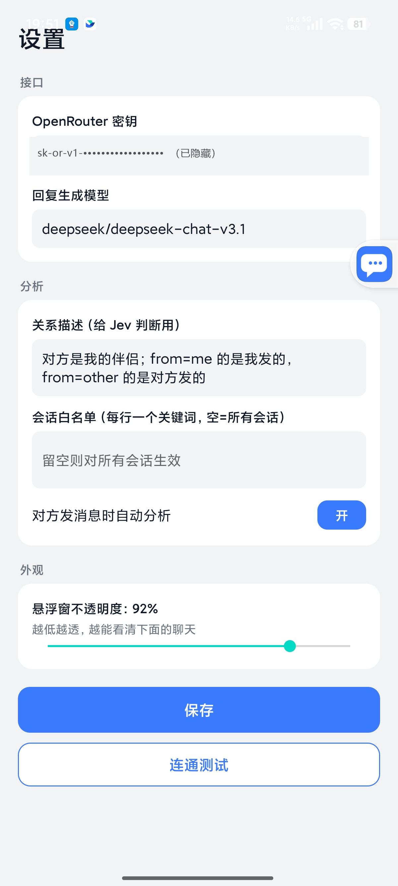

<div align="center">


# Jev 聊天助手

**装在手机上的「对话副驾」：在支持的聊天 App 里读懂对方、告诉你该怎么回，一键填进输入框，发不发由你。**

[](https://github.com/jev-chat/jev-chat-jarvis/stargazers)
[](https://github.com/jev-chat/jev-chat-jarvis/forks)
[](CHANGELOG.md)
[](#快速开始)
[](LICENSE)

[官网](https://chatjevs.com) · [隐私政策](PRIVACY.md) · [历史版本](https://github.com/jev-chat/jev-chat-jarvis/releases) · [更新日志](CHANGELOG.md) · [macOS 版](https://github.com/jev-chat/jev-chat-jarvis-mac) · [Windows 版](https://github.com/jev-chat/jev-chat-windows)

</div>

> **这一份是 [jev-chat-jarvis](https://github.com/jev-chat/jev-chat-jarvis) 的派生（[chat-nojev](../README.md)）。**
> 原版把 7 道判断题和候选排序交给专门的判断模型（TypeSafe Jev），起草另算一次调用；这里合成一次：
> 同一个语言模型写 3 条候选、答那 7 道判断题、点名哪条最好并给每条一个分。题面、选项集合、0–9 的
> 紧张度档位一个字没改（见 `jev/JevQuestions.kt`），悬浮窗读到的 `Analysis` 字段也一模一样，
> **换的只是产出方**——所以 `confidence` / `probabilities` 现在是模型的自评而不是校准过的概率，
> 配置上也只剩「模型接口」一把 key。其余全是原版的代码，连同它的 bug；这一版既没有审过它，也没有
> 在真机上跑过——**下面凡是提到装包和真机实测的段落（「为什么用它」、平台支持表里的「实测」），
> 说的都是 jev-chat-jarvis 那一份，不是这里的改版。** 差分测试的判据和逐场景结果见
> [`docs/EQUIVALENCE.md`](docs/EQUIVALENCE.md)，合并的理由和代价见 [`../docs/MERGE.md`](../docs/MERGE.md)。

## 不是原版的地方

合并本身带来的改动（删掉 `JudgeClient`、判断那一路的配置和设置页那张卡）不算，剩下跟上游的出入全在
这里；根 [README](../README.md#和原版不一样的地方) 里三个变体一起列，长版在 [`../docs/MERGE.md`](../docs/MERGE.md#android)。

- **应用 id `com.jev.probe` → `com.jev.probe.nojev`，启动器名字「Jev助手」→「对话副驾」。**
  不改就只能二选一：安卓按应用 id 认包，同 id 且签名不同的两个包互相装不上去。改了才能和原版
  **并排装在同一台手机上对着比**。Kotlin 包名（`namespace`）没动。
- **无障碍服务的组件名从写死改成动态拼**（`MainActivity` 里 `"com.jev.probe/…SelectToSpeakService"`
  → `"$packageName/…"`）。这是上一条的直接后果：那个字符串要跟系统的 `ENABLED_ACCESSIBILITY_SERVICES`
  比对，而系统那边的条目是「应用 id/类名」。不跟着改，主页会永远报「无障碍没开」。全项目只有这一处
  把应用 id 写成了字面量。
- **签名配置不再默认指向一个 Windows 路径——这是修原版的 bug。** 原版是
  `file(System.getenv("JEV_KEYSTORE_PROPS") ?: "H:/android/keys/jev-release.properties")`。Gradle 的
  `file()` 按 URI 解析字符串，Linux 上那个盘符前缀在配置阶段就转换失败，构建还没走到「要不要签名」
  就死了——**在 Windows 以外的机器上连一个未签名的 release 都打不出来**，尽管它自己的注释写着
  「没有这个文件就出未签名包」。现在没有默认值：环境变量没设就是不签。不修就没有下面那个 APK。
- **`gradlew` 补上了可执行位**（原版提交的是 `rw-r--r--`，`./gradlew` 跑不起来）。
- **版本号 `versionCode 5` / `1.4` 退回 `1` / `0.1.0`**：这是另一份代码，不该冒用它的版本号。
- **`apk/` 目录没有跟着拷过来**：那里面是原版签好名的成品，跟这里的改动无关。
- **3 道 choice 题的答案不再是固定的英文标签，`OverlayController` 里 `INTENT`/`NEEDS`/`ACTION` 三张
  对照表删了**，面板显示模型用对话那门语言写的那句短语。**这一条不是合并逼出来的**——完全可以让
  模型照旧吐英文 key、表原样留着；理由和代价见根 README。数值（危险等级、把握、候选百分比、排序）
  完全不受影响。
- 顺带改对了原版 README 里的一处笔误：危险等级是 **0–9**，不是它写的 1–9。

## ❤️赞助商

> [想出现在这里？](#交流群--需求收集)

<details open>
<summary>点击折叠</summary>

<table>
<tr>
<td width="240" align="center"><a href="https://open.bocha.cn"></a></td>
<td>感谢 <b>博查</b> 赞助了本项目！博查是一个给 AI 用的搜索引擎，让你的 AI 应用连接世界知识，获得干净、准确、高质量的搜索结果。提供 Web Search API、Bocha Jev API 等多种联网搜索和模型服务。<a href="https://open.bocha.cn">open.bocha.cn</a></td>
</tr>
<tr>
<td width="240" align="center"><a href="https://faka.rainlanguage.top"></a></td>
<td>感谢 <b>小优店铺</b> 赞助了本项目！小优店铺是一家数字商品与账号服务店铺，为本项目的用户提供选购渠道。<a href="https://faka.rainlanguage.top">点此前往</a>。</td>
</tr>
<tr>
<td width="240" align="center"><a href="https://agent.ai-tools.cn"></a></td>
<td>感谢 <b>速创猫 Vytal</b> 赞助了本项目！速创猫 Vytal 是专业的 AI 视频工作流平台，提供可批量复用的视频工作流，降低内容制作门槛，服务内容创作者、培训机构及中小团队。<a href="https://agent.ai-tools.cn">点此前往</a>。</td>
</tr>
</table>

</details>

## 截图

<table align="center">
<tr>
<td align="center"><br/><sub>悬浮窗：危险等级、对方真实意图、排好序的 3 条候选回复</sub></td>
<td align="center"><br/><sub>设置页（jev-chat-jarvis 截图：那时还是判断 / 回复 / 视觉三张卡，这一版只剩模型 / 视觉两张）</sub></td>
</tr>
</table>

## 为什么用它

- **它先判断，再写字。** 大多数工具直接让模型编一句回复。这里同一次调用里先答完「对方真实意图、危险等级、该不该马上回」那 7 道题，再据此给出 3 条候选（jev-chat-jarvis 是判断模型单独答题，题目和档位一样）。
- **不动你的聊天软件。** 不 hook、不改包、不走任何 App 的接口或账号、不读数据库，只用系统无障碍服务读「屏幕上正在显示的对话」。
- **发送权永远在你手里。** 程序只把回复填进输入框，从不自动发送，不碰转账 / 红包 / 收款。
- **一套内核，多平台。** QQ、X 真机跑通，飞书靠 OCR 补正文。新增一个 App 只需写一个几十行的适配器；微信 Android 版已全面下架，不再采集或处理微信内容。
- **它认识你的人和事。** 本地知识库与联系人档案，分析时自动带上命中的笔记和这个人的历史，回复不会和你的设定打架。
- **接口自己配。** 模型 / 视觉两路分别可填。分析时，聊天文字和你启用的背景信息会发给你配置的模型服务商；作者不运营中转服务器。
- **本机存储可控。** 密钥、知识库和可选历史存 App 私有空间；截图只在本机 OCR，不上传。第三方服务商如何处理收到的内容，以其隐私政策为准。

## 平台支持

| 平台 | 状态 | 采集方式 | 备注 |
|---|---|---|---|
| QQ Android | ✅ 全链路 | 无障碍读节点 | 9.3.50 实测（群聊）；1v1 按同结构推断 |
| X / Twitter 私信 | ✅ 全链路 | 解析 Compose 节点的 content-desc | 12.25 实测，中文界面；英文界面未验 |
| 飞书 / Lark | ✅ OCR 兜底（真机验证） | 无障碍读气泡矩形 + ML Kit 离线 OCR 识别正文 | 正文自绘不在无障碍树里，1.3 起对每个气泡矩形做 OCR；我/对方按已读状态判 |
| 其它未适配 App（微信除外） | ✅ 手动 | 悬浮窗菜单「截屏识别一次」整屏 OCR | 不自动、不分我/对方（全部当作对方所说并在面板标注）；微信 Android 版已全面下架 |
| macOS / Windows（独立项目） | ✅ 已提供 | 见各自仓库说明 | [macOS 版](https://github.com/jev-chat/jev-chat-jarvis-mac) · [Windows 版](https://github.com/jev-chat/jev-chat-windows) |
| 网页 | ⏳ 规划 | — | 尚无网页版 |

本项目只读你自己设备上、你自己有权查看且当前版本支持的聊天；微信 Android 版已全面下架，不提供微信采集与分析。

## 快速开始

**1. 装包。** **[下载 android-v0.1.0](https://github.com/chy4pro/chat-nojev/releases/tag/android-v0.1.0)** —— `jev-chat-android-v0.1.0-unsigned.apk`（24.5 MB，另附一份 `.sha256`）。仅支持 ARM64 / `arm64-v8a`。

这个 APK **没有签名**：仓库没配签名密钥，CI 就只出未签名包。

**未签名的包装不上，跟「未知来源」没关系。** 那个开关管的是允不允许从应用商店以外的地方装东西；签名是另一道,任何来源都绕不过——安卓的安装器要求每个 APK 都带一个有效签名，没有就报「解析包时出现问题」或者「应用未安装」，权限开得再宽也一样。

要装就得先自己签一次：

```
apksigner sign --ks 你的.jks --out signed.apk jev-chat-android-v0.1.0-unsigned.apk
```

安卓的签名是**自签**的，系统不看是谁签的、也不验证证书链，只要求有一个有效签名且包没被改过，所以 `keytool -genkeypair` 随手生成一把就够用，不花钱、不用申请。签完之后，这个包和别人签的同 id 包互相覆盖不了——签名不一致安装器不认，只能先卸载再装。

这一版用了自己的 application id（`com.jev.probe.nojev`）和自己的启动器名字（**对话副驾**），所以是**装在原版旁边，不是替换它**——这正是目的，见上面[「不是原版的地方」](#不是原版的地方)。

**这个包没有在真机上跑过**，CI 只证明它编译打包成功，不证明它能用；装的人是第一个试的人。想自己用 Android SDK 打一个（比如要签名版），见下面「构建与目录结构」。jev-chat-jarvis 签好名的包在
[Releases](https://github.com/jev-chat/jev-chat-jarvis/releases)，那是**原版**那一版，不含这里的改动。

**2. 填密钥。** 打开 App → 设置 →「接口」分两张卡：模型接口 / 视觉接口。只填「模型接口」那一把 key 就能用（默认模型 `deepseek/deepseek-chat-v3.1`，国内 Gemini / OpenAI 会被区域限制），视觉留空会继承它。换来源就在「模型接口」选预设（OpenRouter / DeepSeek 官方 / 通义兼容）或自填地址，每张卡都有独立的一键连通测试。

**3. 开权限。** 按主页向导开三项：

- 无障碍（读取当前支持的聊天界面；升级到 1.3+ 后需要把无障碍关掉再打开一次，截屏能力才生效）
- 悬浮窗 / 显示在其他应用上层（展示分析）
- 自启动 + 省电无限制（小米 / HyperOS 必做，否则后台被冻结读不到消息）

装过 debug 包的要先卸载再装 release（签名不同），卸载会清掉密钥和设置。小米 / HyperOS 重装后悬浮窗权限会被重置，装完按向导再开一次。

## 功能

### 判断与候选回复

- 一次调用给出：对方真实意图、危险等级（0–9）、对方要什么、该不该马上回、最佳动作，外加 3 条口语化候选和每条的占比。把握度是模型自评。
- 面板一次画完（原版是判断先回、候选后补，中间有「生成中…」；合成一次之后没有这个中间态）。
- 悬浮窗里点一下复制或填入，填入用 `ACTION_SET_TEXT`，失败自动退到剪贴板粘贴，**任何情况下都不发送**。

### 知识库与联系人

在设置 → 分析 →「知识库与联系人」。

- **笔记**：标题 / 内容 / 标签 / 常驻。常驻笔记每次都带；其它笔记要标签或标题出现在会话标题或最近 6 条消息里才带，最多 5 条。支持多行文本粘贴导入，空行分段，每段首行当标题。
- **联系人**：姓名 / 别名（每行一个）/ 关系 / 备注。会话标题匹配姓名或任一别名时生效，自动忽略群名尾部人数、首尾空白和大小写差异。悬浮窗气泡长按可把当前会话一键存为联系人。
- **历史**：「记录聊天历史（只存本机）」默认关闭；开启后每次分析带上最近 N 条（默认 30），并自动去掉屏幕上已经显示过的部分。
- **清除**：知识库与历史都存在 App 私有目录，设置里「清空知识库与历史」一键删除，不进日志、不进 git。具体数据类别、用途、接收方和保留方式见[隐私政策](PRIVACY.md)。
- 悬浮窗面板顶部会显示一行「知识库 N 条 · 历史 M 条」，方便确认到底带了什么。

### 接口与模型

- 模型 / 视觉两路的地址、密钥、模型分别可填。
- 内置 OpenRouter、DeepSeek 官方、通义兼容三套预设，每张卡一键连通测试。jev-chat-jarvis 这几天给判断接口新加的博查 Jev / Vercel / OpenCode Zen 三个预设没有跟过来：它们都是 `POST /v1/systemone` 的判断接口，这一版没有这条路。
- 只有一把密钥也能用：视觉留空自动继承模型接口的配置。
- 从旧版本升级时，原来那把密钥（v1.2 的 `openrouter_key`、v1.3 的判断接口密钥）会一次性迁到模型接口上。

### 采集与 OCR

- 一个 App 一个适配器，服务按前台包名分发，适配器只负责把当前窗口变成「标题 + 消息列表」。
- 无障碍树里没有正文时，对支持的聊天 App 自动截屏并用 ML Kit 中文离线模型识别，不上传图片、不需要 Google 服务。
- 截屏有限频和失败退避，不会每秒连拍；识别时会躲开自己的悬浮窗。
- 未适配的 App（微信除外）可在悬浮窗菜单里手动触发「截屏识别一次」。

## 常见问题

<details>
<summary><b>它会替我发消息吗？</b></summary>

不会。程序只把选中的回复填进输入框，发送键永远由你自己点。转账、红包、收款一律不碰。

</details>

<details>
<summary><b>需要 root 或 Xposed 吗？会不会封号？</b></summary>

不需要 root，也不用装任何模块。它不修改聊天软件的安装包、不注入进程、不调用对方 App 的接口或账号体系，只读系统无障碍服务暴露出来的界面内容，和读屏软件的工作方式一样。

</details>

<details>
<summary><b>我的聊天记录会被上传吗？</b></summary>

触发分析时，当前聊天文字以及你启用的联系人备注、知识库命中内容和历史记录会发送到你在设置里配置的模型接口。项目作者不运营中转服务器，也不会收到这些内容；截图在本机 OCR，不会上传。历史记录默认关闭，开启后仅保存在手机 App 私有目录。第三方模型服务商可能按自己的政策处理请求内容，请在使用前查看[隐私政策](PRIVACY.md)及所选服务商的政策。

</details>

<details>
<summary><b>悬浮球不见了，或者读不到消息怎么办？</b></summary>

多半是国产 ROM 把后台进程冻结了。先确认无障碍、悬浮窗、自启动、省电无限制四项都开着，小米 / HyperOS 尤其要开后两项。重装后悬浮窗权限会被重置，按主页向导再开一次。在聊天界面里随便点一下通常能自愈。

</details>

<details>
<summary><b>飞书里读不到正文？其它 App 能用吗？</b></summary>

飞书的消息正文是自绘控件，无障碍树里没有文字，1.3 起改为对每个气泡矩形做离线 OCR。其它未适配的 App（微信除外），可以在悬浮窗菜单里点「截屏识别一次」，整屏 OCR 后同样能分析，只是不区分我方和对方。

</details>

<details>
<summary><b>要花钱吗？</b></summary>

软件本身免费开源。模型调用走你自己的 API Key，按用量在对应服务商那边结算，项目不经手任何费用。

</details>

<details>
<summary><b>升级之后没反应？</b></summary>

把系统设置里的无障碍开关关掉再打开一次。1.3 起新增了截屏能力，服务需要重新绑定才会生效。

</details>

## 它怎么工作


图中展示数据边界：聊天界面读取与 OCR 在本机完成；触发分析后，文字和启用的背景信息发送到你配置的模型服务商；候选回复由你确认，应用不会代发。详见[隐私政策](PRIVACY.md)。

- **采集**：一个 App 一个适配器，服务按前台包名分发。适配器只负责把当前窗口变成「标题 + 消息列表（谁说的、说了什么）」，下游全部通用；树里没有正文时走截屏 + 离线 OCR 兜底（限频、失败退避，不会每秒连拍）。
- **判断 + 回复**：一次 OpenAI 兼容的 `/chat/completions`。题目原文由 `jev/JevQuestions.kt` 的 `renderJudgmentSpec()` 原样铺进提示词，模型在写候选的同时按同一套标签和档位作答；命中知识库时提示词里带 `background`（关系 + 联系人备注 + 命中笔记）和 `history`（历史消息），并要求回复与之一致、不编造。
- **翻译**：`jev/MergedAnswer.kt` 只把模型给的值搬进 jev-chat-jarvis 那三种答案形状（noul / choice / score）和排序块，再跑它原封不动的那几个解析函数；不查标签表、不夹范围、不归一，也不替模型编值。为什么是这个标准，见 `docs/EQUIVALENCE.md`。
- **回填**：`ACTION_SET_TEXT`，失败则剪贴板 + `ACTION_PASTE`，不发送。

<details>
<summary><b>适配一个新的聊天 App</b></summary>

1. 在 `capture/ChatAppAdapter.kt` 实现 `ChatAppAdapter`：`pkg` 是包名，`extract(root, res)` 从无障碍树取出标题和消息列表（`Msg(side, text)`，`side` 为 `me` / `other`），不在聊天窗时返回 `null`。
2. 在 `capture/ChatCaptureService.kt` 的 `adapters` 加一行。
3. 判断、候选、悬浮窗、填入都不用动。

先用 `adb shell uiautomator dump` 看目标 App 暴露了什么，已有三个专用适配器，另有未适配 App 的手动 OCR 入口（微信 Android 版已全面下架）：

| App | 树的情况 | 适配器怎么做 |
|---|---|---|
| QQ | 节点开放，有 id | 正文 `id/mjn`、标题 `id/371`，按气泡贴哪侧头像判谁说的 |
| X | Compose，无 id，text 为空 | 解析 content-desc `发件人：正文。时间。Read`，发件人是「你」即我方 |
| 飞书 | 正文自绘，树里没有文字 | 树上拿 bubble_content_container 矩形与已读状态，OCR 每个矩形的正文 |

适配器返回 `null` 表示不在聊天窗，返回空消息列表表示在聊天窗但树里没正文——只有后者会触发 OCR 兜底。

QQ、X 全程只有一个 Activity，判「是不是聊天窗」要看树里有没有该有的节点（如输入框），不能看 Activity 名。

</details>

<details>
<summary><b>构建与目录结构</b></summary>

JDK 17 + Android SDK（platform 35 / build-tools 35）。

```bash
./gradlew assembleDebug      # app/build/outputs/apk/debug/app-debug.apk
./gradlew assembleRelease    # 需要仓库外的签名 properties，路径由 JEV_KEYSTORE_PROPS 指定
```

- `app/` — Android 应用（Kotlin，传统 View）
  - `capture/` 无障碍采集：`ChatAppAdapter.kt` 各 App 适配器、`ChatCaptureService.kt` 分发服务、前台保活、`ocr/` 截屏与离线识别
  - `jev/` 模型客户端、题目集与 `MergedAnswer` 翻译层 · `overlay/` 悬浮窗 · `core/` 配置与数据模型（含 `core/kb/` 知识库存储与上下文构建）
  - `KnowledgeActivity` 知识库管理页（笔记 / 联系人）
- `tools/jev/` — jev-chat-jarvis 判断模型的题目集与校准脚手架（Python，原样留着：题目文字的出处在这里，但这一版不再调那个接口）
- `docs/` — 设计与验收文档，外加本版的 `EQUIVALENCE.md`（与它逐字段比对的标准和结果）

</details>

## 已知限制

- **国产 ROM 后台冻结**：小米 / HyperOS 会杀后台进程，前台保活、自启动、省电无限制都配了仍可能被杀，气泡短暂消失，在聊天里再交互一下自愈。
- **飞书正文靠 OCR**：飞书正文是自绘控件，无障碍树里只有气泡矩形，1.3 起对每个矩形做离线 OCR；我 / 对方按已读状态判断，判反时请用「存为联系人」并在备注里说明，或关掉自动分析改手动。
- **X 只按中文界面验过**：分隔符 `：`、`上午 / 下午`、`Read` 是中文界面实测；英文界面只做了兜底，未验。
- **群聊**：按一对一分析，「对方」与关系设定对群聊不准。
- **中文**：题目沿用 jev-chat-jarvis 的英文原文（判断模型的主训练语言是英文），聊天内容保留中文；3 道 choice 题改成让模型用对话那门语言写一句短语作答，因此面板上的用词不再跟它逐字相同。
- **没有真机验证**：CI 在 GitHub 的 runner 上把 `android-v0.1.0` 那个未签名 APK 编译打包了出来（见「快速开始」），但没有人把它装到手机上跑过。差分测试只盯着「判断和排序由谁产出」那一道接缝，采集、OCR、悬浮窗、回填这些原样继承的部分它一点都没看——那些代码在这里**一次都没运行过**。
- **知识库检索是标签/标题包含匹配**，不做语义检索，笔记请打好标签才能被命中。历史按「谁说 + 原文」去重，同一个人重复说同一句只记一次。
- **OCR 依赖系统放行截屏**：无障碍服务要被系统允许截屏才能用，小米 / HyperOS 可能拒绝（面板会提示失败原因）；受保护窗口（`FLAG_SECURE`）截不到。
- **OCR 只认屏幕上看得见的部分**：长消息被截断的部分读不到；识别有错字。
- **包体变大**：ML Kit 中文离线模型让 APK 从约 12 MB 增至约 27 MB，且只打 arm64-v8a。
- **微信 Android 版已全面下架**：当前版本不再采集、OCR、分析或填入微信内容。

## 交流群 / 需求收集

**如需联系，请公众号私信。** 合作、赞助、反馈、进群失败、二维码过期，都走公众号私信，其它渠道不一定看得到。

<p align="center"></p>

想听真实需求：你在哪个聊天 App 上最想要这个副驾？希望它判断什么、怎么提示、什么绝对不能碰？公众号私信直接说。

<details>
<summary>点击展开交流群二维码（都已满或已过期，进群请公众号私信要新码）</summary>

<table align="center"><tr>
  <td align="center"><br/><sub>1 群</sub></td>
  <td align="center"><br/><sub>2 群</sub></td>
  <td align="center"><br/><sub>3 群</sub></td>
  <td align="center"><br/><sub>4 群</sub></td>
  <td align="center"><br/><sub>5 群</sub></td>
  <td align="center"><br/><sub>6 群</sub></td>
  <td align="center"><br/><sub>7 群</sub></td>
  <td align="center"><br/><sub>8 群</sub></td>
  <td align="center"><br/><sub>9 群</sub></td>
</tr></table>

</details>

## 姊妹项目

同在 [jev-chat](https://github.com/jev-chat) 组织下：

- [Jev 聊天助手 macOS 版](https://github.com/jev-chat/jev-chat-jarvis-mac)：消息意图识别悬浮窗，看屏 + 本地小模型判断意图和风险，再按话术生成回复候选，纯只读。
- [Jev 聊天助手 Windows 版](https://github.com/jev-chat/jev-chat-windows)：聊天窗口旁挂的回复辅助，窗口截图 + 本地离线 OCR，3 条候选一键填入，发送永远手动。

隐私政策见 [PRIVACY.md](PRIVACY.md)（说明读取了什么、发给谁、存在哪里、怎么删除）。

## 友情链接

<table>
<tr>
<td width="150" align="center"><a href="https://github.com/lanyijianke"></a><br/><b>蓝衣剑客</b></td>
<td>资深 AI 专家、作家，火山引擎领航 KOL、阿里云 Agent 创客、WaytoAGI 核心创作者。深耕软件开发、系统架构与项目管理，著有《豆包高效办公》《Kimi 高效办公》等畅销 AI 书籍，获京东图书 2025 年度超级新书、2025 机工创作之星；曾参与多项 AI 领域标准及国家级报告起草，为数十家世界百强企业提供企业级 AI 咨询与实施。<br/><br/>GitHub：<a href="https://github.com/lanyijianke">@lanyijianke</a> · 微信：lanyijianke1992</td>
</tr>
</table>

## 版权与许可

Copyright © 2026 Finderchangchang 与 jev-chat 贡献者。代码以 [MIT](LICENSE) 协议开源，另见 [NOTICE](NOTICE)。

- **可以商用**：个人和公司都可以使用、修改、再分发，或集成进自己的产品，不需要付费或事先授权。
- **必须注明出处**：分发或商用时保留 LICENSE 与 NOTICE，并在产品「关于」页、说明文档或发布页写明来源。推荐写法：`基于 Jev 聊天助手（https://github.com/jev-chat/jev-chat-jarvis）二次开发`。
- 不要用「Jev 聊天助手」「jev-chat」名称或 chatjevs.com 域名暗示由原作者出品或背书。

**隐私与免责声明**：触发分析时，聊天文字和启用的背景信息会发送到你自行配置的第三方模型服务商；截图仅在本机 OCR。请阅读[隐私政策](PRIVACY.md)以及所选服务商的政策，并遵守 QQ、X、飞书等软件的许可协议与当地法律法规。作者不对第三方服务商的数据处理行为或使用后果负责。

