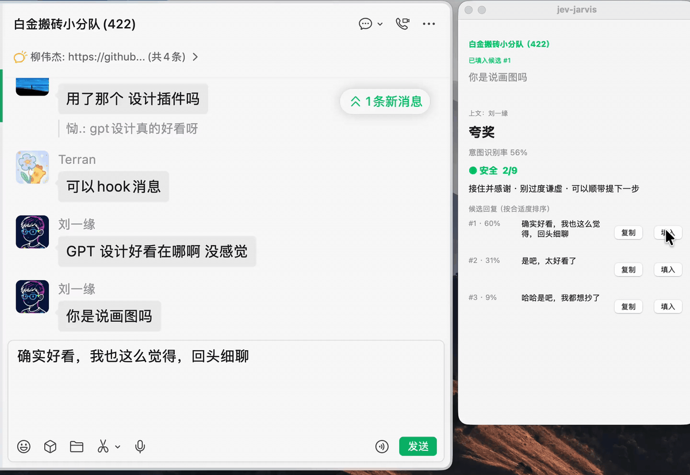
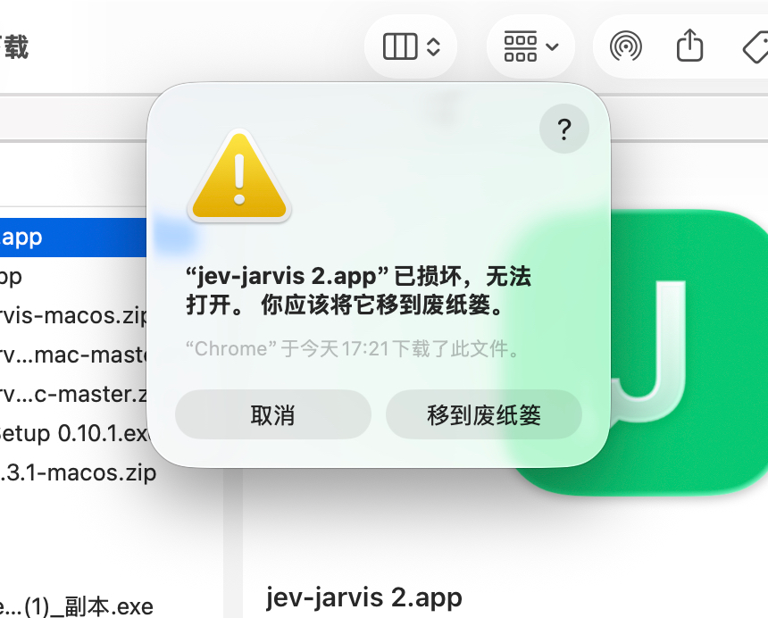

# jev-chat-jarvis（macOS）

微信弹出一条消息 → 悬浮窗立刻告诉你**这句话的真实意图**、**风险几级**、**该怎么回**。

**纯只读、零封号风险**——不注入、不 hook、不解密数据库，只是「看屏幕 + 一次模型调用」。

> **这一份是 [jev-chat-jarvis-mac](https://github.com/jev-chat/jev-chat-jarvis-mac) 的派生（[chat-nojev](../README.md)），只改了一件事。**
> 原版有两个模型：判断层（本地 `Mapika/decider-2b`，或云端 TypeSafe Jev）出意图和风险、再单独问一次
> 「哪条回复最合适」，生成层只写候选。这里把它们合成一次——写候选的模型顺手答那两道判断题、
> 写「具体行动」、并给自己写的每条候选打分。题面、8 类意图的描述、0–9 的风险判据一个字没改
> （见 `src/questions.py`），面板读到的字段也一模一样，**只是产出方换了**。这道接缝有一套差分测试
> 对着原版逐字段盯着，判据、逐场景结果和 5 处有意为之的分歧见
> [docs/EQUIVALENCE.md](docs/EQUIVALENCE.md)——**那是关于这一处的证据，不是对这个 App 的质量判断**。
>
> **其余全是原版的代码**：抓窗口、Vision OCR、话术与起草的提示词、面板、填入输入框、
> 「不替你按发送」那条边界，连同原版的 bug 和粗糙处一起留着。这一版没有审过这些代码，也没有 Mac
> 可以跑它。「只改了一件事」不成立的几处列在下面[「不是原版的地方」](#不是原版的地方)，
> 其中最重的一处是：**判断不再能只在本地跑了**。



> 这张演示图是 **jev-chat-jarvis-mac 的原图**，没有重录。

## 不是原版的地方

合并本身带来的改动（删掉判断层的客户端、`TYPESAFE_*` 配置和设置页那一页）不算，剩下的全在这里；
仓库根的 [README](../README.md#只改一件事不成立的地方) 里三个变体一起列。

- **本地判断模型删了，判断从此必须出网。** 原版的判断层可以完全在本机跑（`Mapika/decider-2b`，
  约 7 GB，不要 key、不联网），只有起草那次调用出网。合并之后判断和候选是同一次请求，这条路没有了；
  跟着 `src/judge.py` / `src/judge_jev.py` 一起删掉的还有内存不足时的保护、预热状态行、云端 TypeSafe
  判断层，以及那份 22 条的中文意图回归测试（`judge_zh_test.py`，那个「86.4%」的出处）。躲不掉：
  判断和候选出自同一次请求，就不可能只让其中一半留在本机。**丢的是隐私，不是离线能力**——生成层
  指向本地服务（Ollama）时整条链路照样可以不出网，见「配置」。题面和那些表原样搬进了
  `src/questions.py`，顶上记着要恢复得做什么。
- **候选的分从「跨话术可比」变成「话术内占比」。** 原版是所有话术生成完之后再单独调一次排序，
  那一次看得见全部候选；这一版每种话术一次调用，每次只看得见自己写的那两条。面板实际用的排序没变
  （它本来就在组内排），变的是左边那个百分比的含义。躲不掉：分是跟候选一起回来的。
- **原本藏在判断适配器里的兜底挪到了面板上。** 原版 `JevJudge.judge` 在交出答案的路上会悄悄改它：
  意图查不到就落回「闲聊」、风险不是数字就记 `0.0`、缺 `confidence` 就当 0%。适配层只翻译不做主，
  兜底就得换个地方——`src/hud.py` 长出几个只管自己那一行的读取函数。后果是同一份坏数据两边显示不同
  （原版「● 安全 0/9」，这一版「风险待判断」），那 5 处逐条记在 [docs/EQUIVALENCE.md](docs/EQUIVALENCE.md)。
  顺带修掉一个真实隐患：原版 `float(value or 0.0)` 碰上非数字的模型分会抛异常，把 UI 线程带走。
- **意图不再限定在那 8 个标签里**，面板显示模型自己写的那句短语，`confidence` / `intent_probs` 是
  模型的自评而不是校准过的概率。**前半条不是合并逼出来的**——完全可以要求模型照旧吐那 8 个标签之一；
  理由和代价见根 README。
- **`MAX_TOKENS` 300 → 1200**：两张概率表塞不进 300，截断就整个对象作废。
- **版本号 `0.4.0` 退回 `0.1.0`；`torch` / `transformers` / `huggingface-hub` / `laya` 从依赖里删了**
  （本地模型没了，没人用它们）。`uv.lock` 还是原版那一份、还锁着这四个——没在 macOS 上重跑过
  `uv lock`，**这是个已知的不一致**。

## 交流反馈

用着有问题、想提需求、想一起改，扫码进群（**1 群已满，从 2 群开始扫，满了顺序换下一个**）；群二维码 7 天失效，过期了在 issue 说一声：

<table>
  <tr>
    <td align="center"><br><sub>2 群</sub></td>
    <td align="center"><br><sub>3 群</sub></td>
    <td align="center"><br><sub>4 群</sub></td>
    <td align="center"><br><sub>5 群</sub></td>
  </tr>
</table>

都满了或者不想进群，直接找我：加个人微信（备注来意），或关注公众号后台私信：

<table>
  <tr>
    <td align="center"><br><sub>个人微信</sub></td>
    <td align="center"><br><sub>公众号</sub></td>
  </tr>
</table>

## 它能做什么

- **意图 + 风险**：8 类意图的描述仍是题面（jev-chat-jarvis-mac 在本地模型上测得零样本 86.4%，22 条回归口径；**这一版换了产出方，那个数字不适用**），风险 0–9 分级 + 行动建议，跟候选同一次调用出
- **候选回复**：内置 10 种话术并发生成（每条一稳一放各出 2 条）→ 先上屏 → 带着同一次调用给的分原位重排；换话术立刻按当前消息重新生成
- **快**：消息一出现就起跑一次调用，判断和候选一起回来（它是判断先上屏、候选晚一秒；这一版两者同时出现）
- **YOLO 检测框**（可选，`JEV_BOXES=1` 启动即开、菜单栏可切）：OCR 命中的消息实时框在微信窗口上，对方/我分色 + 置信度

## 面板读法

面板使用 macOS 原生浅色磨砂材质：顶部是当前聊天、分析状态、正在处理的消息与上下文；中间依次显示意图、识别率、风险等级和行动建议；底部按话术分组展示候选回复。当前风险圆点会轻微呼吸提示。每条候选左侧是模型给这条的分（**话术内**的比例：jev-chat-jarvis-mac 那次排序调用看得见所有话术的候选，这一版每次调用只看得见自己写的两条），右侧仍只有「复制」和「填入」；候选行会随完整文字自动增高，不截断内容，发送始终由用户在微信里手动完成。

「不用」的话术槽只保留一行下拉选择，不生成也不占候选行；开启或关闭话术只改变面板高度，不改变判断与轮询流程。黄色窗口按钮收起到聊天名与状态，红色窗口按钮退出。

## 用法

**只想用**：**[下载 chat-nojev macos-v0.1.0](https://github.com/chy4pro/chat-nojev/releases/tag/macos-v0.1.0)** —— `jev-jarvis-macos-v0.1.0.zip`（0.1 MB，同一个 Release 下还有别名 `jev-jarvis-macos-latest.zip` 和一份 `SHA256SUMS` 校验和）。解压拖进「应用程序」，**第一次右键 → 打开**（没做公证，双击会被 Gatekeeper 拦）。

zip 只有 0.1 MB 不是漏打包：`.app` 里是一个很小的启动器，首次运行时才联网拉自己的 Python 依赖（见下面「缺少可用的 uv 时」那段）——这是原版自己的设计，这一版没有改动它。构建用的是 `macos-latest` 这个 Apple Silicon（arm64）runner，`.app` 里的原生启动器也是 arm64。

> **这个包在本项目里没有被装到真机上跑过。** 这台开发容器里没有 Mac，CI 在 GitHub 的 runner 上把它打包成功、能解压回验，证明的是「打得出来」，不是「装了能用」——没人在真实的 macOS + 微信环境里验证过。装的人是第一个试的人。



弹窗若显示「**已损坏，无法打开，你应该将它移到废纸篓**」（浏览器下载的 zip 常见，右键打开也绕不过），别删——在终端清掉隔离属性即可：

```bash
sudo xattr -r -d com.apple.quarantine /Applications/jev-jarvis.app
```

`.app` 若改过名（如「jev-jarvis 2.app」），把命令里的目录名换成实际路径。

首次启动按提示授予「屏幕录制」权限（系统设置 › 隐私与安全性 › 录屏与系统录音，给 **jev-jarvis** 打开），**退出重开**生效；「填入」另需「辅助功能」权限，第一次点会弹系统授权框。v0.3.1 及更早的旧版本还需把 **python3.12** 那条一并打开。

缺少可用的 uv 时，两种启动入口都先完整下载并执行官方安装脚本（下载含超时和重试），失败后尝试已有的 Homebrew。失败提示区分网络、证书、磁盘和安装器错误，详细输出见 `~/Library/Logs/jev-jarvis.log`。官方脚本安装到 `~/.local/bin`，不修改 shell 配置。

**从源码跑**（微信在运行、终端已授予屏幕录制）：`./start.command`。分层自测：

```bash
uv run python src/perception.py                  # 感知层：识别到的消息 + 耗时
uv run python src/questions.py                   # 题面：8 类意图 / 10 档风险 / 渲染出的判断说明
uv run python src/generate.py --check            # 凭据解析（就这一把 key）
uv run python src/generate.py "这个需求你今天跟一下"  # 真发一次：候选 + 判断 + 分
uv run python tools/offline_check.py             # 解析器 + 面板读法（不联网，坏值全覆盖）
uv run python -B -m unittest discover -s tests   # 发出消息/异步结果回归（合成 OCR，不读屏）
uv run python probe/bootstrap_regression.py      # 两种启动入口的离线回归；不联网、不实际安装
```

## 配置

一把 key、可以不填：打包版内置共享 key，不配也能用，数据流向见 [PRIVACY.md](PRIVACY.md)。
（jev-chat-jarvis-mac 是两层两把 key，判断层不填就走本地 decider-2b（约 7 GB），那次判断调用完全不出网；这一版判断跟着候选一起出，
**判断不再能单独留在本地了**——配哪个端点，意图、风险和候选就一起走哪个端点，一个都不配就一起没有。把端点指向本地 Ollama 仍然整条不出网，没有了的是「云端写候选 + 本地判断」那一种组合。）
全部配置在一个 env 文件（**不提供第二种格式**）：

### 可视化配置（#18）

点击悬浮窗右上角 **齿轮图标（模型设置）**，或菜单栏 **J → 模型设置…**，可编辑 OpenAI 兼容、Anthropic 兼容两组密钥、服务地址与模型（原版还有一页「判断 · Jev」，判断合进这一次调用之后没有对应配置了）。
设置窗口显示在悬浮窗上方，不会被面板遮挡。**保存后必须退出并重新打开应用**；保存不会切换本次运行的配置。

- 窗口编辑 `$XDG_CONFIG_HOME/jev-jarvis/env`（未设置时为 `~/.config/jev-jarvis/env`），显示具体路径。只修改所编辑服务的字段，保留其他配置、注释和未识别行，文件权限设为 `600`。文件被其他程序修改时拒绝覆盖，需重新打开窗口。
- 填好地址与密钥，点击「获取模型列表」从该服务的 `/models` 接口动态获取，再下拉选择；不内置模型清单。OpenAI/Anthropic 按 `data[].id` 读取。接口不支持、失败或返回空列表时明确提示，仍可手填，不自动换模型或服务。空下拉显示「暂无」（仅作提示，不作为模型保存或调用），仍可手填；底部动态提示以蓝色显示进行状态、绿色显示成功、红色显示错误。列表可见不代表一定有生成权限，选定后再测试。
- 「测试连接」使用窗口内**尚未保存**的地址、密钥和模型发起实际调用，仅发送固定问候语，不读取微信内容；可能产生少量服务费用。生成层必须返回非空文字才算成功，不能用 `--check` 的配置解析成功代替连接成功。
- 密钥掩码显示；窗口仅读取所编辑文件中的值，不把环境变量、项目 `.env` 或内置共享密钥复制进用户文件。各配置页顶部突出显示本次启动正在使用自己的密钥还是内置共享密钥，以及实际来源；同时标明当前启用的服务，优先级保留在窗口下方。
- 环境变量优先于用户 env，用户 env 优先于项目 `.env`；生成层 OpenAI 组优先于 Anthropic 组，均未配置才使用内置共享密钥。清空当前文件的密钥不会禁用其他来源中的密钥。由终端或启动器导出的值也显示为「环境变量」。
- API 格式由密钥组决定：`OPENAI_*` 使用 OpenAI 格式，`ANTHROPIC_*` 使用 Anthropic 格式；自定义地址不需要包含服务名称。Ollama 可填 `http://localhost:11434/v1`、密钥 `ollama`，模型从本地服务获取或手填。
- 钥匙串：不新增钥匙串读写。如果原 env 用 `$(security find-generic-password …)` 等 shell 表达式提供密钥，窗口不执行表达式、不展示其内容，未输入新密钥时保留原行；仍由已有启动器执行。要在窗口测试该服务，需明确输入密钥；保存将用输入值替换原表达式。外部注入的密钥继续遵循环境变量优先级。
- `JEV_BOXES`、`JEV_TONES`、`OPENAI_EXTRA_BODY` 暂仍通过 env 配置，保存窗口不会改动它们。OpenAI 连接测试沿用当前启动的 `OPENAI_EXTRA_BODY`；完整话术管理等留待后续扩展。

也可继续手动编辑：

```bash
mkdir -p ~/.config/jev-jarvis
cat > ~/.config/jev-jarvis/env <<'ENV'
# 就这一把：任意 OpenAI 兼容端点。候选回复和意图/风险是同一次调用
export OPENAI_API_KEY="sk-你的key"
export OPENAI_BASE_URL="https://api.deepseek.com"
export OPENAI_MODEL="deepseek-chat"
# 端点的思考模式要靠额外字段关时填（Qwen3 这类不关会慢几十倍）
# export OPENAI_EXTRA_BODY='{"enable_thinking":false}'
ENV
chmod 600 ~/.config/jev-jarvis/env
```

- **凭据解析以 key 为准**：提供 key 的来源同时决定端点和模型。实测可用：DeepSeek `deepseek-chat`（最快）；智谱 `glm-4-flash`（换 `ANTHROPIC_API_KEY`/`ANTHROPIC_BASE_URL`/`ANTHROPIC_MODEL`，两组都填 OpenAI 组优先）；本地 Ollama `qwen2.5:7b`（完全不出网）
- **别用 thinking 模型**：思考吃光 `max_tokens`，候选 0 条，面板只报「候选生成失败」——DeepSeek 认准 `deepseek-chat`
- **自定义话术**：env 加一行 `JEV_TONES`（`|` 分隔、每条「名字=说明」，同名覆盖内置，重启生效），如 `摸鱼大师=像资深摸鱼选手，把活推得漂亮又不失礼`；说明写清「什么语气 + 别变成什么」最管用
- 自查凭据（不打印完整 key）：`uv run python src/generate.py --check`

## 磁盘占用与清理

| 内容 | 位置 | 大小 | 清理 |
|---|---|---|---|
| Python 运行环境（venv） | `~/Library/Application Support/jev-jarvis/venv` | jev-chat-jarvis-mac ~0.7 GB（含 torch）；这一版不装 torch/transformers，只剩 PyObjC，实际小得多（未在 macOS 上实测） | 删除 .app 不会连带删它，需手动删 |

它还有一项：判断层本地模型 `decider-2b`，`~/.cache/huggingface/hub/models--Mapika--decider-2b`，约 7 GB。这一版不下载任何模型。

生成层配 Ollama 的话模型在 Ollama 自己的目录（`~/.ollama`），非本项目下载。

## 已知限制

- **没有在 Mac 上跑过**：这台开发容器里没有 Mac，整个 App 在这个仓库里一次都没启动过。下面这些限制是 jev-chat-jarvis-mac 记下来的，原样继承（只有标明的那两条例外）
- 悬浮窗只在微信位于前台时显示和分析；切到浏览器等其他应用会立即隐藏并丢弃未完成的旧结果，返回微信后强制重新读取当前聊天，避免把旧面板误认为正在识别其他应用
- 收发方向靠文字位置判断：横跨左右或居中、无法确认方向的文本标「方向未确认」，**不作为回复目标**（很宽的对方消息可能被跳过）；只有明确识别为「对方」的消息才触发判断与生成，只有自己消息时面板显示「等待可确认的对方消息…」
- 图片/表情包读不出内容；引用回复当普通文本；公众号卡片可能被当消息解读；微信全屏布局下识别可能失效（布局常量待动态化，见 #17）
- 微信改版会让布局常量失效（`src/perception.py` 顶部常量需重新校准）；多窗口优先识别主窗口「微信 / WeChat」
- 判断和候选现在一起上屏：jev-chat-jarvis-mac 的意图/风险通常比候选早一秒左右出现（两个模型并行跑），这一版它们是同一份回答的两部分，所以同时出现
- 判断没读出来（模型这次没给 judgment）时状态行会红字说明，候选照常上屏；不对劲先看日志（分阶段耗时、**不含消息正文**，可放心贴 issue）：`tail -40 ~/Library/Logs/jev-jarvis.log`

## 输入区检测框与填入

菜单栏「YOLO 检测框」同时显示消息框和输入目标，约每秒刷新：蓝色实线表示辅助功能接口定位到的输入控件，橙色虚线表示从截图边界推测的输入区；无法定位时显示原因。虚线不代表已取得可写控件，也不修复 #17 的聊天区域固定比例问题。

「填入」优先通过辅助功能接口写入并读回确认。部分微信版本不提供输入控件时，显式点击「填入」会尝试视觉兼容路径：复核窗口、输入区和标题，激活微信、点击输入区、输入文字，再用 OCR 核对。该路径需要屏幕录制及辅助功能权限，会移动鼠标；填入期间请勿操作键鼠或切换聊天。不会自动按发送键，也不使用剪贴板或 Cmd+V；换行和制表符转换为空格。

兼容路径读到已有草稿时停止，提示使用「复制」手动插入；辅助功能路径仍追加原有文字。窗口、焦点或会话变化时停止，画面无法确认时提示检查草稿，不自动重试。视觉边界及 OCR 都可能误判，标题检查也不是会话 ID，不能消除用户同时操作时的竞争；深色主题、多显示器与其他微信版本仍需更多验证。

## 下一步（按优先级）

1. **攒标注数据**：把误判的（尤其「催进度 vs 问进度」）记下来，微调冲 95%+
2. **区分聊天消息和分享的文章卡片**：保守过滤，风险是误杀正常消息

## 开发者

- **贡献前必读**：[CONTRIBUTING.md](CONTRIBUTING.md)——动代码前先在 issue 认领（评论 + assignee），分层自测改哪层跑哪层
- 配置界面自测：`uv run python -B -m unittest discover -s tests`；macOS 原生窗口与按钮流程：`uv run python -B probe/settings_smoke.py`（临时配置 + 本地测试服务，不使用个人密钥）。
- 打包 `./packaging/build_app.sh`；发版 `./packaging/release.sh --publish`（干净 worktree 构建 + 解压回验 + gh release）。版本号只有 `pyproject.toml` 一处；有开发者证书可加 `--sign "Developer ID Application: ..."`
- 架构一句话：微信在前台时，进程内抓其窗口 → Vision OCR（只扫聊天区）→ 每种话术一次 LLM 调用，意图/风险/行动/每条候选的分跟候选一起回来 → 悬浮窗 NSPanel。底层仍按窗口 ID 抓取而不是全屏截图，悬浮窗不污染 OCR
- 与 jev-chat-jarvis-mac 的等价性怎么证明：[docs/EQUIVALENCE.md](docs/EQUIVALENCE.md)，差分测试在仓库根的 `tools/equivalence_check_macos.py`。它只盯「判断和排序由谁产出」那一道接缝；抓窗口、OCR、面板、填入这些原样继承的部分它一点都没看，而且在这个仓库里**一次都没运行过**

## 许可与免责

MIT（见 `LICENSE`）。只读**你自己屏幕上、你自己账号的**聊天内容，不注入、不 hook、不解密数据库、不自动发送任何消息。请在自己设备上自用；装到别人机器上读别人的聊天记录是另一回事，本项目不为那种用法背书。微信改版可能导致布局识别失效，请遵守微信软件许可协议。

**隐私与数据流向**详见 [PRIVACY.md](PRIVACY.md)：聊天内容只发给模型服务商——推荐自配 API key 或本地 Ollama；内置免费通道经作者中转，承诺与提醒见该页。**这一版判断也走同一次调用**（jev-chat-jarvis-mac 的判断默认在本地跑，不经网络），所以用云端端点时，判断的内容现在也跟着候选一起出网了——同一条消息仍只发一次请求，但离开这台机器的内容比以前多。生成端点指向本地服务（Ollama，`PRIVACY.md` 也这么建议）时整条链路照样不出网，这条路没变；没有了的是另一条：**用云端端点写候选、同时让判断留在本机**。
