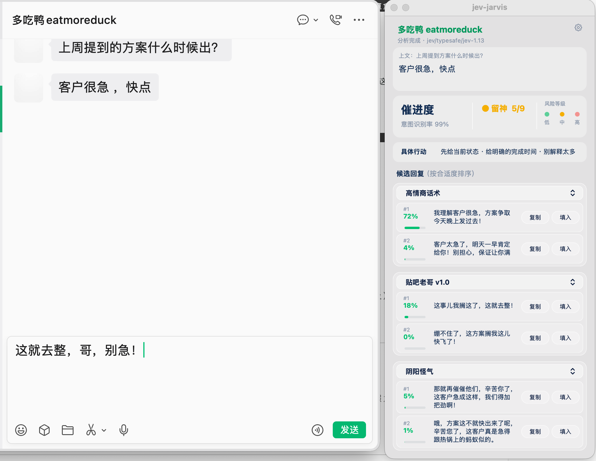
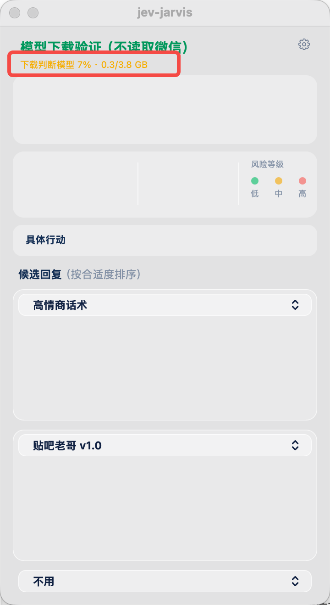
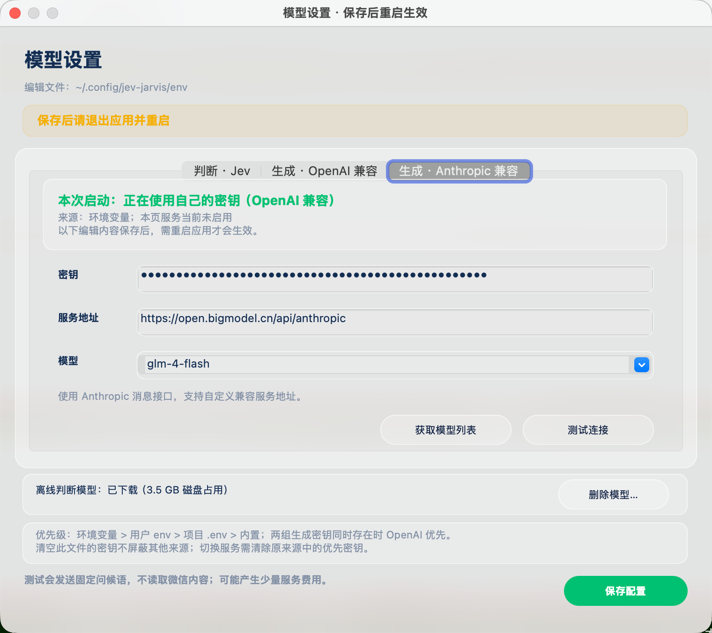
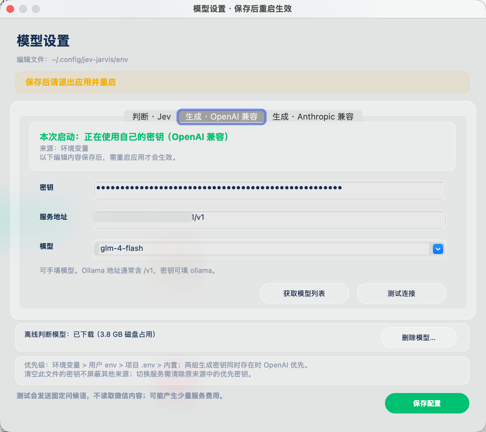
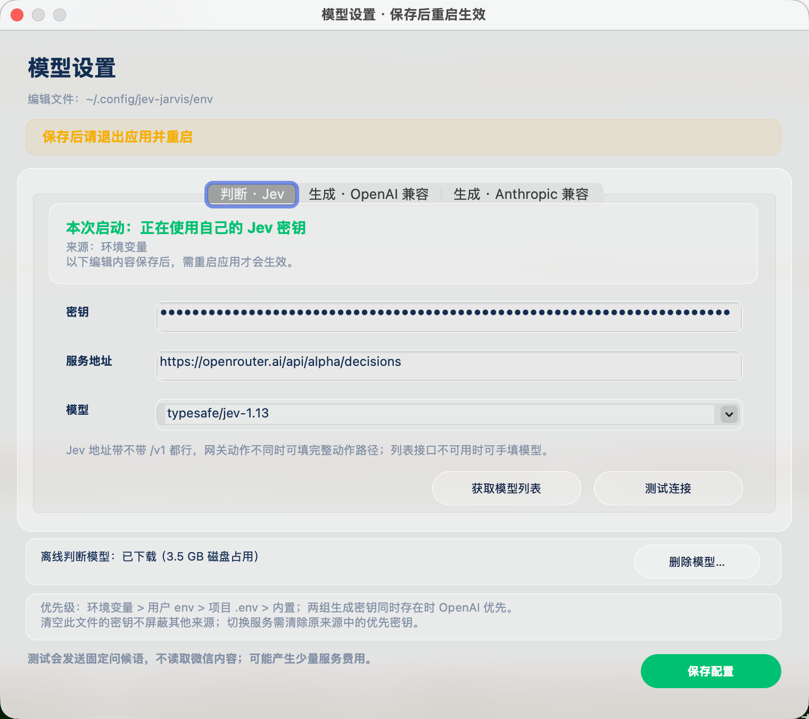

# jev-jarvis v0.5.0

> **注意（chat-nojev 改版）**：这篇是**上游**在两个模型、三次调用那个架构下写的推广/发布稿，逐字保留作为历史材料。本仓库这一份把判断和排序合进了生成那一次调用，本地判断模型（decider-2b）已删除——文中关于「本地判断」「不出网」「离线模型」「下载进度」「首次选判断方式」「3.8 GB 模型」「86.4%」的说法都不适用于这一版，以 README 和 docs/EQUIVALENCE.md 为准。

**一句话**：新用户上手不再懵——首次启动自己选判断方式，离线模型不再偷偷下载、下载有实时进度；面板默认多一组「阴阳怪气」。



## 这版的重点

### 首次启动自己选判断方式（#38）

未配置判断层 key 的新用户，首次启动会弹一次选择：

- **配置 key 在线判断**（推荐）：轻量、无下载，走 TypeSafe Jev 或任意兼容网关
- **下载离线模型**（约 3.8 GB）：下载后完全离线可用
- **稍后再说**：先跳过，面板会持续提示

离线模型**不再启动即偷偷下载**；选过的不再问，之后随时可在「模型设置 → 判断 · Jev」页改主意、删除离线模型（页面显示实际占用）。

### 模型下载有实时进度了（#41）

旧版首次下载/加载模型时，面板一片安静，分不清「在下载」还是「卡死了」。这版状态行实时显示：

```
下载判断模型 34% · 1.2/3.8 GB → 加载判断模型… → 预热判断模型…
```



完成自动恢复消息状态；下载/加载失败会红字说明原因，不再无声无息。旧版「一片空白不知道在干嘛」的问题从此根治——老版本用户建议直接升到这版。

### 面板默认三组话术，「阴阳怪气」直接可用

默认话术从两组变三组：**高情商话术 / 贴吧老哥 v1.0 / 阴阳怪气**。旧版第三格默认「不用」，实测大家都会手动勾上它——现在默认就有，每个下拉随时可换成其余语气或关掉。

## 自定义 key 怎么配

判断与生成都支持自带 key，全部在**悬浮窗右上角齿轮（模型设置）**里可视化编辑，三组密钥各自独立、互不干扰：

| 设置页 | 用途 | 可以填 |
|---|---|---|
| **判断 · Jev** | 意图/风险云端判断 | TypeSafe key；或兼容网关，如 OpenRouter：`https://openrouter.ai/api/alpha/decisions` + 模型 `typesafe/jev-1.13` |
| **生成 · OpenAI 兼容** | 候选回复 | 任意 OpenAI 兼容端点：DeepSeek、智谱、本地 Ollama（`http://localhost:11434/v1`，密钥 `ollama`）等 |
| **生成 · Anthropic 兼容** | 候选回复（另一协议） | 任意 Anthropic 兼容端点，如智谱 `https://open.bigmodel.cn/api/anthropic` |

- 「获取模型列表」直接从该服务的 `/models` 拉取下拉选择，接口不支持可手填
- 「测试连接」发送固定问候语实测可用性（不读取微信内容，可能产生少量服务费用）
- **保存后退出并重新打开应用**才生效；优先级：环境变量 > 用户 env > 项目 .env > 内置共享 key
- 不配任何 key 也能用：判断走本地模型，生成层打包版内置共享 key







## 兼容性与修复

- **WeChat 4.x 底部贴窗输入区兼容**（#52）：新版微信贴底输入区识别更稳
- **短联系人标题保留**（#36）：单字/两三个字的联系人名不再被当杂字丢掉；聊天右侧控件不再混进消息；无消息可附着的孤立发送者名丢弃（#72）
- **窗口选择更准**（#56）：只认「微信 / WeChat / Weixin」精确应用名，微信读书、微信输入法、企业微信不再干扰窗口选择
- **OpenRouter 等网关兼容**（#53）：判断层 `TYPESAFE_BASE_URL` 支持非版本段+动作词的网关地址（如 `https://openrouter.ai/api/alpha/decisions` + 模型 `typesafe/jev-1.13`，key 用 OpenRouter 的 `sk-or-…`）
- **Intel Mac 启动提示**（#57）：x86_64 环境启动时中文明确提示仅支持 Apple Silicon（不要用 Rosetta，torch 无 Intel 版）
- **日志如实标注后端**：排序耗时行按实际后端显示（`Jev https://…` 或 `本地 decider-2b`），不再写死「本地模型」

## 开发与文档

- **CI**：PR 与 master push 自动跑离线回归（103 条，macOS runner）
- **FAQ**：新增 [docs/FAQ.md](FAQ.md) 与置顶 issue——配置文件 / 日志 / 模型路径 / 安装报错 / 旧版空白，一条卡一个命令
- **隐私说明**：[PRIVACY.md](../PRIVACY.md) 上线，数据流向一页说清

## 安装 / 升级

需要 **macOS 13+、Apple Silicon**。下载 zip，解压把 `jev-jarvis.app` 拖进「应用程序」。

- **第一次打开**：右键（或按住 Control 点）→ 打开 → 再点「打开」。未做 Apple 公证，双击会被 Gatekeeper 拦，只需这一次。
- 若弹「**已损坏，无法打开**」（浏览器下载的 zip 常见，右键无效）：终端执行 `sudo xattr -r -d com.apple.quarantine /Applications/jev-jarvis.app` 后再打开。
- **第一次启动**：按提示授予「屏幕录制」权限后退出重开；「填入」首次使用时另授「辅助功能」。
- 判断层未配 key 时首次启动会引导选择（在线 or 离线模型），也可以稍后再说。

**从旧版升级**：直接用新的 `.app` 覆盖旧的即可，配置在 `~/.config/jev-jarvis/env`，不受影响。旧版「启动后一片空白」的现象在这版根治，建议尽快更新。

文件校验：`SHA256SUMS` 与安装包在同一 Release 页。

## 反馈

交流群（1 群已满，从 2 群开始扫）和公众号都在 README「交流反馈」；**新版本都在公众号通知，建议关注**。bug 和建议走 Issues 最好跟踪。
