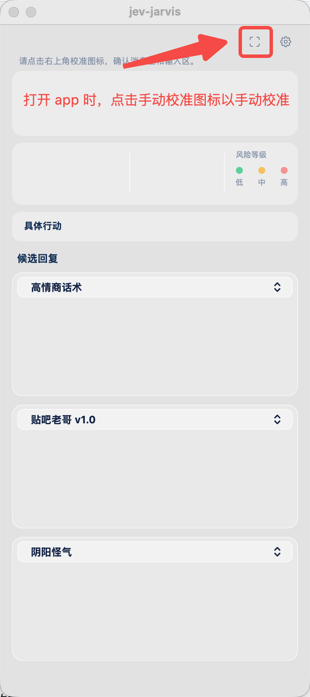
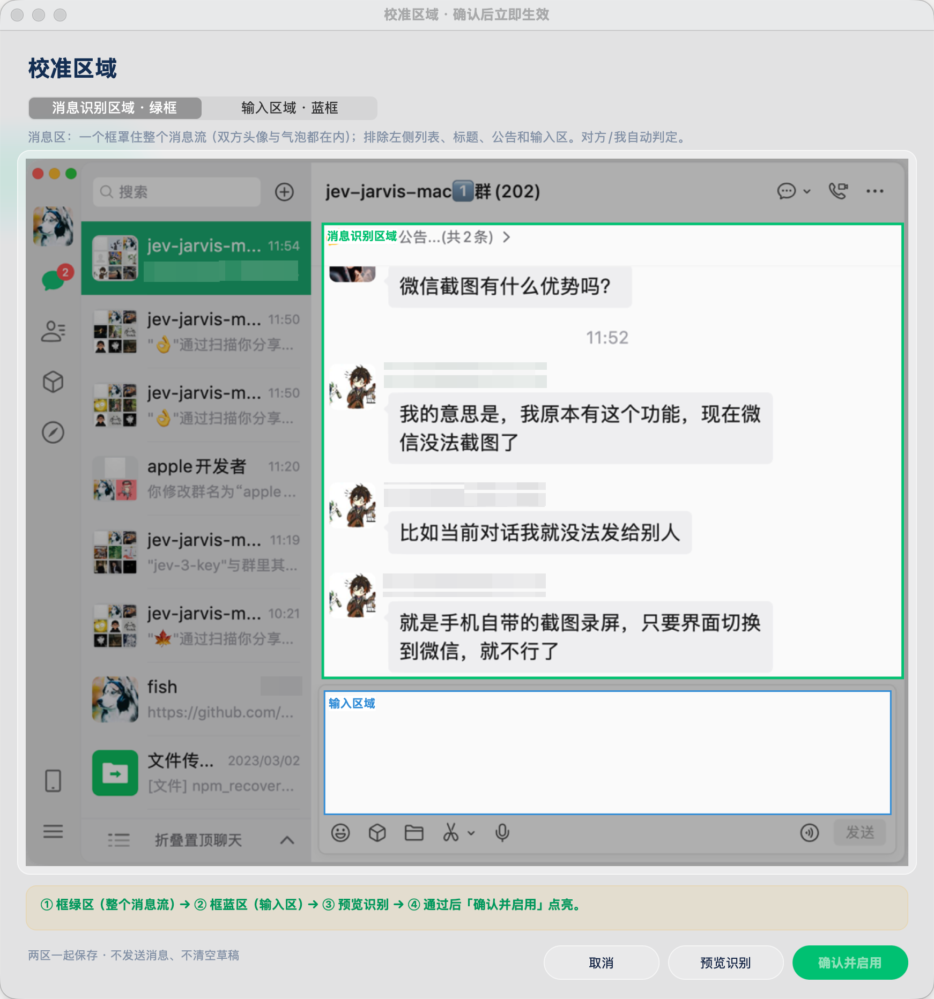
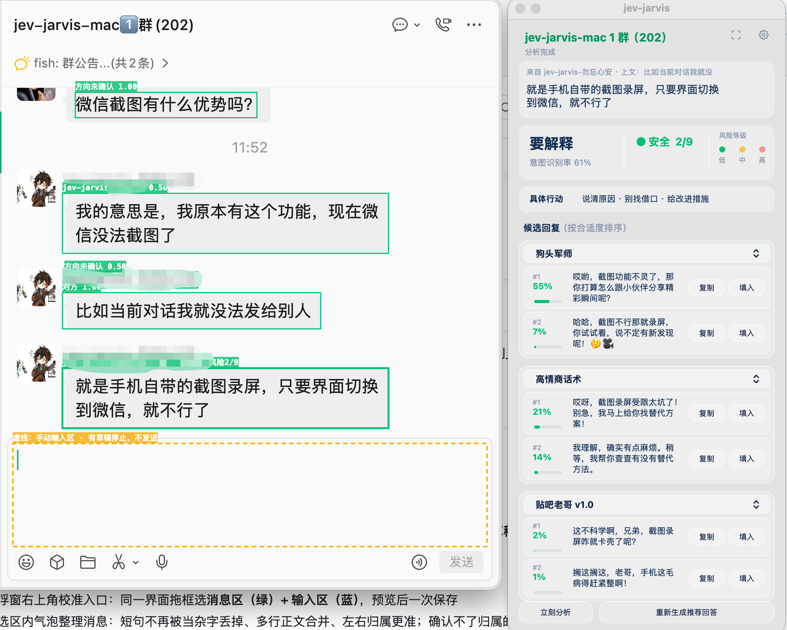

# jev-jarvis v0.6.0

> **注意（chat-nojev 改版）**：这篇是**上游**在两个模型、三次调用那个架构下写的推广/发布稿，逐字保留作为历史材料。本仓库这一份把判断和排序合进了生成那一次调用，本地判断模型（decider-2b）已删除——文中关于「本地判断」「不出网」「离线模型」「下载进度」「首次选判断方式」「3.8 GB 模型」「86.4%」的说法都不适用于这一版，以 README 和 docs/EQUIVALENCE.md 为准。

**一句话**：QQ（QQNT）来了；微信 4.x 有了人工区域校准，独立聊天窗、贴底输入区这些「识别不到」的场面都能治；填入手感也顺了。

## 这版的重点

### 人工区域校准：识别准确度大幅提高（#81、#89）

微信 4.x 联系人列表可拖宽、独立聊天窗乱飘，固定比例的自动识别经常漏消息、读到列表摘要。人工校准按你框选的**真实气泡**整理消息——**识别准确度大幅提高**：短句不再被当杂字丢掉、多行正文完整合并、左右归属更准。

打开 app 时，点击右上角手动校准图标即可进入：

同一界面拖框选消息识别区域（绿框）与输入区域（蓝框），预览通过后一次保存：

- 消息区（绿框）罩住整个消息流（双方头像与气泡都在内），排除左侧列表、标题、公告和输入区，对方/我自动判定
- 确认不了归属的文字**不进上下文、不自动回复**
- 校准数据存在本地配置，窗口挪动不用重画

### QQ（QQNT）支持（#77）

- 同一个悬浮窗同时适配**微信与 QQ**：谁在前台读谁、给谁填
- QQ 走**系统无障碍树**直接读消息——不截图、不 OCR、不解密，纯只读原则不变
- QQ 的「填入」同样辅助功能（AX）写入优先、键盘事件后备，**不发送、不碰剪贴板、不覆盖草稿**

### 一键「立刻分析」/「重新生成推荐回答」（#74）

- 面板底部两个按钮：前者重新读屏+完整分析，后者沿用当前判断只重跑候选（换话术后快速重出）
- 菜单栏「J」里同样有「立即重新分析」

### 新话术：狗头军师·恋爱三件套 / 夸夸（#90）

内置新增恋爱向「狗头军师」三件套（稳健 / 会撩 / 抽离）与「夸夸」。识别效果实拍——微信消息实时框选标注，面板按话术分组给出候选并带本地排序概率：

自定义话术加最低质量门槛：描述太糊会拒绝加载并提示怎么写，不再悄悄失效。

### 会话背景进上下文（#79）

- 自动带上最近几轮对话做背景，判断意图与生成候选更贴合上下文
- 历史只存本地，可随时清除

### 判断模型：离线加载 + 国内镜像（#98）

- 模型已缓存时**完全离线加载**，启动不再卡网络检查
- 首次下载不可达时自动切国内镜像，下载有实时进度

## 顺手修掉的

- **切回微信一片空白 / 独立聊天窗识别不到**（#92）：读屏窗口改为跟随系统焦点窗口，适配微信 4.x 独立聊天窗
- **拖窗口面板跟不上**（#94）：面板吸附与读屏解耦，拖窗后 0.5 秒内跟上
- **「填入」防呆**（#106）：输入目标不属于前台应用时拒绝并提示等检测框更新；修复手动校准模式下误报「属于另一应用」导致**填入必失败**的回归
- **填入后鼠标停在微信里**（#108）：视觉填入完成自动把光标送回原位，换话术不用再挪鼠标
- **刷屏时漏消息/串台**（#76）：OCR 空帧沿用上一帧不重置停稳，在途任务及时作废
- **抓图加固**（#84、#85）：新版 macOS 上抓图卡死改为带超时的子进程采集，失败有兜底、日志降噪
- 读屏日志如实分开「抓取 / OCR」两段耗时（#110）

## 给开发者的

- CI：覆盖率双棘轮门禁（#87）、合并队列（#100）、issue 每小时自动 triage（#102）、首个「认领」评论自动设 assignee（#97）、子 issue 全关自动收父 issue（#114）
- 完整变更见 commit 列表

## 安装 / 升级

需要 **macOS 13+、Apple Silicon**。下载 zip，解压把 `jev-jarvis.app` 拖进「应用程序」。

- **第一次打开**：右键（或按住 Control 点）→ 打开 → 再点「打开」。未做 Apple 公证，双击会被 Gatekeeper 拦，只需这一次。
- 若弹「**已损坏，无法打开**」（浏览器下载的 zip 常见，右键无效）：终端执行 `sudo xattr -r -d com.apple.quarantine /Applications/jev-jarvis.app` 后再打开。
- **权限**：读微信需授「屏幕录制」；读 QQ 与「填入」需授「辅助功能」——首次使用时系统会弹。
- 判断层未配 key 时首次启动会引导选择（在线 or 离线模型），也可以稍后再说。

**从旧版升级**：直接用新的 `.app` 覆盖旧的即可，配置在 `~/.config/jev-jarvis/env`（含校准数据），不受影响。

文件校验：`SHA256SUMS` 与安装包在同一 Release 页。

## 反馈

**合作、反馈、进群，请公众号私信**；也可扫码进交流群（1、2 群已满，从 3 群开始扫）。二维码见 [README](../README.md) 文末「交流反馈」。bug 和建议走 Issues 最好跟踪。
