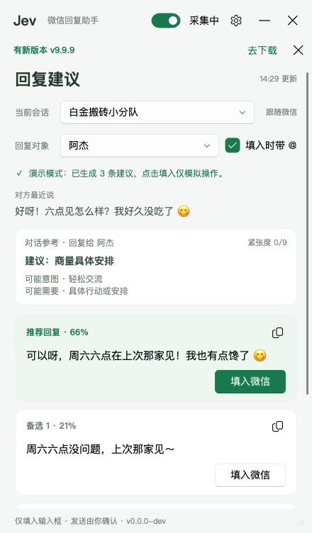
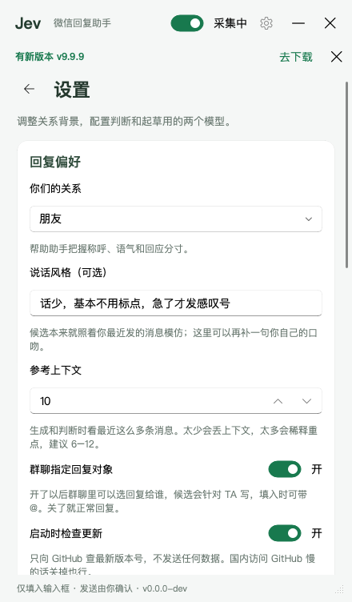
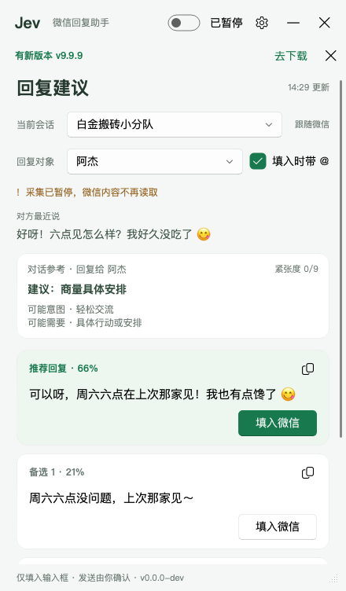

# JevChat-Windows

本仓库只维护当前这一套识别。有能力的人可以 Fork 后自行适配别的聊天窗口，作者不提供这项适配，也不对 Fork 出去的改动负责。

## 公众号

反馈和合作走公众号「恸码奇点」。扫左边的码，或者搜一搜这个名字。

<p align="center"></p>

聊天窗口旁挂的回复辅助：本地 OCR 读屏上的对话 → 一次模型调用同时给出判断和 3 条候选回复 →
一键填入输入框。**发送永远手动，程序不替你按发送。**

> **这一份是 [jev-chat-windows](https://github.com/jev-chat/jev-chat-windows) 的派生（[chat-nojev](../README.md)）。**
> 原版把判断和排序交给专门的判断模型（TypeSafe Jev），起草另算一次调用；这里合成一次：同一个语言模型
> 写 3 条候选、答那 7 道判断题、并点名哪条最好。题面、选项集合、0–9 的紧张度档位一个字没改
> （见 `core/questions.py`），界面读到的字段也一模一样，**换的只是产出方**——所以 `confidence` /
> `probabilities` 现在是模型的自评而不是校准过的概率，配置上也只剩 `LLM_API_KEY` 一把 key。
> 其余全是原版的代码，连同它的 bug；这一版既没有审过它，也没有在真机上跑过。
> 差分测试的判据和逐场景结果见 [`docs/EQUIVALENCE.md`](docs/EQUIVALENCE.md)，合并的理由和代价见
> [`../docs/MERGE.md`](../docs/MERGE.md)。

采集这一侧来自安卓版 [Finderchangchang/jev-chat-JARVIS](https://github.com/Finderchangchang/jev-chat-JARVIS)
的 Windows 改写：窗口截图 + 离线 OCR。

## 不是原版的地方

合并本身带来的改动（删掉判断那一路的客户端、配置和设置页那一节）不算，剩下跟原版的出入全在这里；
根 [README](../README.md#和原版不一样的地方) 里三个变体一起列，长版在 [`../docs/MERGE.md`](../docs/MERGE.md#windows)。

- **选择题的答案不再是固定的英文标签。** 原版由分类器作答，只能从封闭的 key 集合里挑，界面拿
  `core.questions.CHOICE_LABELS`（jev-chat-windows 后来把这张表从 `app/overlay.py` 挪了过去）翻成固定的中文；
  这一版让模型用**对话那门语言**写一句短语，那张表删了，面板显示模型
  写的那句。**这一条不是合并逼出来的**——完全可以让模型照旧吐英文 key。选它的理由见根 README。
  代价：常见情况下用词跟原版很接近但不逐字相同，英文对话显示英文。数值不受影响。
- **jev-chat-windows 的三段式落成了字段顺序 + 一条提示词约束。** 原版先让 Jev 答判断题，把判断折成中文小抄喂给
  起草，最后再让 Jev 排序（它的 v0.1.10，见下面的更新记录）。这一版只有一次调用，于是把 `judgment`
  排在 `replies` **前面**（模型先写下判断，后面的候选才是顺着它写的），并在提示词里照搬了原版那句
  要求：三条候选都要顺着「建议动作 / 对方意图 / 对方需要」写。原版判断失败退回盲起草的那条退路
  这里没有对应物——判断和候选在同一个回答里，没有单独失败这回事。
  `core.questions` 里只为小抄存在的 `guidance_text()` / `CHOICE_LABELS` 因此没有消费者，一并删掉。
- **更新检查关掉了。** 原版启动时（可关）查一次 `api.github.com/repos/jev-chat/jev-chat-windows`
  ——那是**原版自己的** Release 页，版本号跟这里的代码不是一回事，查到「有新版」只会把人导去装
  另一个程序。现在 `app/update.py` 的 `_REPO` 留空，一个请求都不发。设置页那个开关和标题栏的提示条
  还在代码里，现在是死路，**还没清理**。
- **`max_tokens` 400 → 1600（思考模式 4000 → 5200）。** 400 是只写三句话的量，判断和概率表跟着回来
  就会被截断，整个 JSON 作废。方向上躲不掉，具体数字是拍的。
- **`core/llm.py` 加了 JSON 模式**（OpenAI `response_format` / Gemini `response_mime_type`，端点不认
  就脱掉重发）。不是非加不可，但这一版要的是一个结构化对象而不是纯文本，加上它更稳；默认关着。
- **key 的回退改成认来源了。** jev-chat-windows 里 `LLM_API_KEY` 空着就退到 `DEEPSEEK_API_KEY`，
  不看你选的是哪家——只设了 DeepSeek key 却选 OpenRouter 的人，会把 DeepSeek 的 key 发给 OpenRouter
  （它那边 `JEV_API_KEY` 退到 `OPENROUTER_API_KEY` 也一样，判断渠道选 TypeSafe 直连照退不误）。
  这一版把惯用变量名写在每家来源自己那一行，只有选中这家时才拿它当回退；没有公认惯例的几家留空。
  脱敏名单反过来是**更宽**的，六个名字全遮，不管这次会不会读它——解析要窄、脱敏要宽，两张表不能合并。
  代价是明的：只设了 `DEEPSEEK_API_KEY` 又选了别家的人，从「悄悄能用（key 发错家）」变成「未配置」。
- **`docs/KICKOFF.md` 被就地改了。** 那是原版立项时写的说明，按理该原样留着。
- **截图没重拍。** 下面那几张 `docs/*.png` 还是原版的图，上面是它那套固定中文标签和两节模型卡片。

## 下载即用（推荐）

**普通使用直接下载，不用装 Python、不用碰源码。** 后面的「源码运行」是给开发者的。

👉 **[下载 chat-nojev windows-v0.1.0](https://github.com/chy4pro/chat-nojev/releases/tag/windows-v0.1.0)**

1. 在 Release 页下载 `jev-chat-windows-v0.1.0.zip`（165.5 MB）
2. 解压到一个固定目录（整个文件夹一起，exe 要用旁边那堆文件）
3. 双击 `jev-chat-windows.exe`

要求：Windows 10 1903+ / 11，聊天窗口开着，一个 API key（见下）。

首次启动会弹设置页填这把 key。key 写进 Windows 用户环境变量（注册表 `HKCU\Environment`）——
全程只有 `LLM_API_KEY` 这一个，不落任何文件；其余设置写在 exe 旁边的
`config.json`，整个文件夹拷走设置也跟着走。

这是 PyInstaller 的 onedir 打包，体积大是因为整个文件夹里带着离线 OCR 模型和 Qt。
exe 没签名，SmartScreen 会拦一下：「更多信息」→「仍要运行」。介意就往下看「自己打包」，自己打的更踏实。

> **这个包在本项目里没有被装到真机上跑过。** CI 在 `windows-latest` 上把它编译打包成功，证明的是「打得出来」，
> 不是「装了能用」——没人在真实的 Windows + 微信环境里验证过。装的人是第一个试的人。

## 使用说明

**第一次启动**

设置页的「模型」卡片只有一节，填一把 key：

1. **起草 · 语言模型** —— 写那三条候选，同时判断意图、紧张度并给候选排序（一次调用全做完）。
   默认 **DeepSeek 官网**直连，key 在
   [platform.deepseek.com](https://platform.deepseek.com/) 申请（很便宜，一次几厘钱）。
   换别家见下面的表，OpenAI / Anthropic / Gemini 三种接口都支持。
2. 选「你们的关系」（恋人 / 朋友 / 同事 / 家人 / 自定义），保存。可以用了。

换来源要重填一次 key（只存这一把）。

**为什么默认 DeepSeek 官网直连**

这是整条链上唯一一次网络调用。OpenRouter 在国外，从国内过去要等好几秒、还时不时抽风；
DeepSeek 官方 API（`api.deepseek.com`）国内直连，基本就是一次 HTTP 请求的时间，体感差好几倍。
所以默认就是它，不用改。key 只进注册表，不落文件。

**日常怎么用**

- 聊天窗口开着、别最小化（用别的窗口盖住没事），把要聊的会话点开
- 对方来一条消息 → 悬浮窗几秒后给判断摘要 + 三条候选（带模型给的胜出概率）
- 点「填入」→ 文字进输入框 → **你自己看一眼、改一改、按发送**。程序永远不碰发送
- 你切到哪个会话，悬浮窗就跟到哪个；群聊会带上发言人名，想指定回复给谁去设置里开「群聊指定回复对象」
- 暂时不想让它读聊天：标题栏开关拨到「已暂停」

**花多少钱**

只有对方来新消息才调**一次**模型（DeepSeek Flash，判断和候选一起回来），十分钟没人说话就是十分钟零调用。
比原版少一次调用，但这一次的输出更长（判断字段带概率表），`max_tokens` 相应从 400 提到 1600。
思考模式默认关，别开——写三句话用不上，慢好几倍还贵。

## 截图

> 这三张是 **jev-chat-windows 的原图**，没有重拍：设置页还是两节模型卡片，面板上还是它那套固定的
> 中文标签。布局没变，变的是那几处文字和少掉的一节。

<table>
<tr>
<td width="33%"></td>
<td width="33%"></td>
<td width="33%"></td>
</tr>
<tr>
<td align="center">回复建议：「当前会话」跟随当前窗口、群聊多一行「回复对象」，3 条候选带概率百分比，推荐那条置顶</td>
<td align="center">设置：关系背景、说话风格、参考上下文条数、群聊指定回复对象（往下还有「模型」卡片）</td>
<td align="center">采集暂停：不再读取聊天，已有候选照样能填入、能复制</td>
</tr>
</table>

## 功能

- **跟着当前会话走**：会话名从面板头部 OCR 出来，记录、上下文、候选都按会话分开存；也可以自己
  在下拉框里选另一个会话，翻它的记录和上次的建议（那会儿只能看不能填）。
- **群聊**：每条消息前面的发言人名会一起喂给模型，所以它知道哪句是谁说的；打开「群聊指定回复对象」
  还能选回复给谁，三条候选都按 TA 写，填入时可带「@名字 」前缀（纯文本）。
- **3 条候选**：每条带模型给的胜出概率百分比，按概率排序，推荐那条置顶并标「推荐回复」；
  每条都有「填入」和复制按钮。
- **判断摘要**：建议动作、可能意图、对方可能需要、紧张度 0–9。
- **采集开关**：标题栏一拨就停，WGC 会话一起停掉（Win10 的黄框跟着消失），已有候选不受影响。
- **实时聊天记录**：底部展开，看 OCR 到底读出了什么，认错了一眼就能发现。
- **调试视图**（可选）：另开一个窗口，实时画出截到的画面和每个识别框——绿 = 我、蓝 = 对方、
  灰 = 过滤掉的灰字、橙 = 当成发言人名、红 = 当成图片丢掉、黄 = 小字丢掉，外加消息区和头部的框、
  OCR 耗时、这一帧读出来的每一行。识别不对时一眼看出是哪一步的锅。只在内存里画，不存图。
- **模型随便换**：12 家预设（默认 DeepSeek 官网），OpenAI / Anthropic / Gemini 三种协议都支持，
  也能填自己的 Base URL。全程只要一把 key。
- **思考模式开关**：默认关；开了模型先想再写，更斟酌但慢好几倍、贵一些。
- **参考上下文条数**：3~30，默认 10，那一次调用按它取最近 N 条。
- **说话风格**：一句话描述自己的口吻，补在「照着你最近发的消息模仿」之上。
- **响应式悬浮窗**：置顶、可拖可缩，最小 320×360，窄于 400 进紧凑模式。
- ~~**新版本提示**~~：原版启动时（可关）查一次 GitHub 最新版本号并在标题栏下面提示。
  **这一版关着**（见上面「不是原版的地方」），设置里那个开关打开也不会发请求。

## 隐私与边界

这是个人自用工具，下面几条是硬约束，代码里就是这么写的：

- **只读自己电脑上、自己本来就有权查看的对话。** 不代替任何人查看别人的聊天。
- **只截自己的聊天窗口 + 本地离线 OCR（RapidOCR）。** 不 hook、不注入、不读对方数据库、不解密、
  不碰对方进程内存。
- **截图只在内存里。** 捕获到的帧是 numpy 数组，全程不写磁盘、不进日志、不上传；主程序（`app/`、`core/`）
  里没有 `.save()`。`probe/`、`tools/` 下的开发脚本（人工排查、预览界面用的）会把图存成文件，但这些
  脚本不在发布包里，普通用户拿到的 exe 不含它们。
- **调试视图也只在内存里画。** 那个窗口拿到的是子进程缩小后的同一份内存帧（走进程队列，不落盘），
  画完就丢，不存图、不进日志、不上传；关掉开关子进程连帧都不发。
- **绝不自动发送。** 只把文字粘进输入框就停手，不发回车、不点发送按钮。发不发、改不改，你来定。
- **不碰钱。** 转账、红包、收款相关的界面元素一律不碰，起草的 system prompt 里也禁了这几个话题。
- **只有对方的新消息到来（或你在群里换了回复对象）才调一次模型。** 静默期零调用——十分钟没人说话
  就是十分钟零 token。
- **API key 只进环境变量，而且全程只有一个。** `LLM_API_KEY`，不管来源选哪家都是这一个槽。
  写进注册表 `HKCU\Environment`（跟 `setx` 同一个地方），任何文件里都不出现 key，也绝不进日志
  （报错文本一律脱敏）。这个槽空着时，会退回**当前选中那家**自己的惯用变量——选 DeepSeek 读
  `DEEPSEEK_API_KEY`、选 OpenRouter 读 `OPENROUTER_API_KEY`，以此类推（没有公认惯例的那几家没有
  回退）。只认选中的那一家：拿 A 家的 key 去调 B 家的接口，是把密钥发给了不该拿到它的一方。
  回退读到的值留在原处，不会被抄进 `LLM_API_KEY`——一抄就又变成跟着你换来源走的全局 key 了。
  原版那把判断模型的 `JEV_API_KEY` 这一版用不上了，设置页也不再问它。
- **不查更新。** 原版启动时会向 GitHub Releases API 发一个 GET 查版本号；这一版把它关掉了
  （`app/update.py` 的 `_REPO` 留空），因为那个地址指着 jev-chat-windows 自己的 Release。
  设置页「启动时检查更新」那个开关还在，打开也不发请求。

什么会出网：只有那一次调用（`LLM_API_KEY`），发给你
在设置里选的那家接口（DeepSeek 官网、OpenRouter、OpenAI、Moonshot、智谱、通义、硅基流动、
OpenCode Go、Anthropic、Gemini，或者自填的 OpenAI 兼容 / Anthropic 兼容地址）。原版还会在启动时查一次
版本号，这一版连这个请求也没有。**本项目没有任何自建服务器**，聊天内容只在触发分析的那一刻，发给你自己在设置里
配置的那个接口，本项目不收集、不落盘、不进日志。发出去的内容固定是：**最近 N 条对话文本**（N =
设置里的「参考上下文」，默认 10；群聊带发言人名）、**关系设置**、**你自己最近 12 条 60 字以内的短
消息**（当口吻样本，链接和长段不送）、**你填的说话风格**，群聊指定了回复对象的话再加一个对象名。
除此之外没有别的。OCR 全程离线。

**会不会因此被封号？** 本项目不 hook、不注入、不读对方的数据库或进程内存、不调用对方的任何
私有接口或账号体系——只截自己这一个窗口的画面做 OCR，跟读屏软件、录屏软件是同一类操作。

## 工作原理

```
WGC 截聊天窗口（GPU 合成窗口也能截，被遮挡也能截）
  → 像素锚点定位消息区（认底色和分隔线，不写死坐标，深浅主题通用）
  → OCR 面板头部的会话名当 key（头部像素没变就不重跑），记录、上下文、候选都按会话分开存
  → RapidOCR 只认消息区那一块
  → 按气泡颜色分 me / her，灰字（引用块、时间戳、群里的发言人名、链接卡片）过滤掉，
    发言人名摘出来挂到它下面那条消息上
  → 跟上一帧比，滚动翻出来的旧消息不重复上报
  → 冒出新的 her 消息才调 core.engine.analyze()：一次调用，同一个对象里先判断、后候选
  → 悬浮窗给判断摘要 + 3 条候选 → 点「填入」
```

截图和 OCR 跑在独立子进程里（一帧 OCR 250~800ms，放 Qt 主线程界面会僵），父进程只管界面和网络调用。

### 模型

**候选 + 判断 + 排序，一次调用（key：`LLM_API_KEY`）**

| 来源 | 接口协议 | 地址 | 默认模型 |
| --- | --- | --- | --- |
| DeepSeek 官网（默认） | OpenAI | `api.deepseek.com` | `deepseek-flash` |
| OpenRouter | OpenAI | `openrouter.ai/api/v1` | `deepseek/deepseek-v4.1-flash` |
| OpenAI | OpenAI | `api.openai.com/v1` | 自己选 |
| Moonshot (Kimi) | OpenAI | `api.moonshot.cn/v1` | 自己选 |
| 智谱 GLM | OpenAI | `open.bigmodel.cn/api/paas/v4` | 自己选 |
| 通义千问 | OpenAI | `dashscope.aliyuncs.com/compatible-mode/v1` | 自己选 |
| 硅基流动 | OpenAI | `api.siliconflow.cn/v1` | 自己选 |
| OpenCode Go | OpenAI | `opencode.ai/zen/go/v1` | `deepseek-v4.1-flash` |
| Anthropic | Anthropic | `api.anthropic.com` | 自己选 |
| Google Gemini | Gemini | SDK 自带 | 自己选 |
| 自定义 · OpenAI 兼容 | OpenAI | 自己填 | 自己选 |
| 自定义 · Anthropic 兼容 | Anthropic | 自己填 | 自己选 |

没有默认模型的来源，在设置页点「获取模型」拉一次列表自己挑（也能直接手打模型 id）。
OpenCode Go 的列表只留走 `/chat/completions` 的模型（DeepSeek、GLM、Kimi、MiMo 等）；
MiniMax、Qwen 走 `/messages`，Grok、GPT 走 `/responses`，选了会失败，所以不放进下拉框。
三种协议各走自家官方 SDK（`openai` / `anthropic` / `google-genai`），不自己拼 HTTP。

**那一次调用要回什么**：一个 JSON 对象，字段**按这个顺序**——`judgment`（7 道判断题）、
`replies`（恰好 3 条）、`best_reply`（点名 `reply_a/b/c` 其中一个）、`reply_scores`（每条一个 0~1
的分）。顺序是有意的：原版先问判断、再把判断当小抄喂给起草（它的三段式，见更新记录里的 v0.1.10），
这一版只有一次调用，`judgment` 写在前面就是那个「先后」——判断先落到文本里，三条候选才是顺着它
写出来的，提示词里也照搬了原版那句要求（顺着「建议动作 / 对方意图 / 对方需要」写）。
解析不看顺序（走 `json.loads`），这条只对模型生效。题目原文（选项集合、
0–9 的紧张度判据、排序那道题的说法）由 `core/questions.py` 的 `render_judgment_spec()` 原样铺进
提示词，那里是这些文字唯一的家。其中 3 道 choice 题的**答案**跟原版不一样：它是判断模型从固定
英文标签里挑一个、界面再按一张对照表翻成中文；这一版让模型直接用**对话那门语言**写一句短语
（选项和判据还是那些英文 key 和说明，只是不再照抄 key），界面原样显示，见下面那段和
`docs/EQUIVALENCE.md`。OpenAI / Gemini 两种协议会顺带打开各自的 JSON 模式
（`response_format` / `response_mime_type`）；地址不认这个字段（400/422）就脱掉重发一次。
Anthropic 没有等价开关，只能靠提示词。

解析（把 JSON 从回答里抠出来）该兜的都兜：围栏、前后废话、截断的半个对象、整段不是 JSON 的逐行兜底。
**适配这一层只搬键，不校验**：标签、分数、每条的分一律按模型给的原样递给 `core/engine.py` 和悬浮窗。
它们本来就得防着原版那个判断模型吐垃圾——`best_reply.choice` 认不出就退第一条、分取不出数记 0、
紧张度不是 0–9 的有限数字就显示「紧张度待判断」、choice 不是字符串就显示「暂未判断」。
在适配层再夹一次只会让同一份坏值的表现跟它不一样（它给 11 分显示「待判断」，夹成 9 就成了
「紧张度 9/9」）。模型整条没给的字段就不出现，但绝不替它编一个值。排序整块没读出来就退回第一条、
分记 0；点名和最高分打架时**以点名为准**（原版也是这样：界面把点名那条强制排第一，分只用来给其余的
排序）。候选被去重和防注入过滤光时 `analyze()` 抛 `JevError`（「起草结果没有可用候选回复」），
不会在取第一条时 IndexError。`tools/offline_check.py` 把这些坏形状都喂一遍，不联网，并且把同一份值
喂给 `app/overlay.py` 里真正那几行渲染代码，看它显示成什么。为什么是这个标准、跟原版逐键比对的结果，见
`docs/EQUIVALENCE.md`。

温度 1.2，`max_tokens` 1600（原版 400 是只写三句话的量，判断跟着回来就不够了）；思考模式默认关，
开了会带上各家自己的思考开关、`max_tokens` 提到 5200（思考过程也算进去）。思考开关只有
DeepSeek / OpenRouter / Anthropic / Gemini 认。模型只给出 1~2 条候选时，会带着它的回答追问一次，
只要补齐的候选和分（判断不再问一遍）；追问也失败就按手里的实际条数走。

### 为什么走 OCR

目标窗口界面自绘在一块 GPU 合成画布上
（`MMUIRenderSubWindowHW`）。UIA 树只有 2 个节点、**没有控件树**——`probe/probe_win.py`、
`probe/probe_win2.py` 实测证伪。

所以唯一干净的非侵入采集路 = 截自己的聊天窗口 + 本地 OCR。离线、零 token。

### 为什么起草不那么像 AI

- system prompt 是中文写的反模板规则：不总结不复述、不解释自己为什么这么回、不用「首先/其次/总之」和
  「亲/您/加油哦」这类客套、不排比不凑三段式、句尾别习惯性加句号、允许不完整的句子和口头语、
  三条不是「温暖版/负责版/行动版」而是同一个人三个心情下随手打的（其中一条可以只有几个字）。
- 喂口吻样本：把你自己最近 12 条短消息原样给它，照着你的用词、句长、标点习惯写；设置里的
  「说话风格」再补一句你自己的描述。
- 收尾还做了清洗：剥掉编号、方括号、引号和照抄的「me:」前缀，去掉句尾句号（`？！～` 留着，那是语气）。

## 环境要求

下载 exe 的只看前三条；Python 只有源码运行 / 自己打包才需要。

- **Windows 10 1903+ 或 Windows 11**（Windows Graphics Capture 的最低要求）
- **Python 3.10–3.12**（Releases 里的 exe 是 CI 用 3.11 打的；只想用 exe 的话不用装 Python。3.13+ 不行：rapidocr-onnxruntime 1.4.x 官方包 requires_python 封顶 <3.13，pip 会静默改装 1.2.3，启动即 KeyError）
- **聊天窗口**
- **一把 API key**：`LLM_API_KEY`，默认来源
  [DeepSeek 官网](https://platform.deepseek.com/)。详见下面「使用说明」

> Win10 上 WGC 会在目标窗口外画一圈黄框，系统不给关；Win11 才能关掉。
> 嫌碍眼就把标题栏的采集开关拨到「已暂停」，黄框立刻消失。

## 源码运行（开发者）

普通使用请直接用上面的[下载即用](#下载即用推荐)。想改代码、调 prompt、自己打包才需要这一节。

```bash
git clone https://github.com/chy4pro/chat-nojev.git
cd chat-nojev/windows
python -m venv .venv
.venv\Scripts\activate
pip install -r requirements.txt
python main.py
```

PyCharm / VS Code 里直接 Run `main.py` 也行。

首次启动会自动弹出设置页：填那把 key（`LLM_API_KEY`，见上面「使用说明」），
选你们的关系（恋人 / 朋友 / 同事 / 家人 / 自定义）。key 写进注册表 `HKCU\Environment`，重启后依然有效，
不落任何文件；其余设置写进项目根的 `config.json`（已在 `.gitignore` 里）。

### 自己打包

双击 `build.bat`（没有 `.venv` 会自己建一个，装依赖、调 PyInstaller，一路到底），或者手动：

```bash
pip install -r requirements.txt pyinstaller
pyinstaller --noconfirm --clean jev.spec
```

出来的是 `dist\jev-chat-windows\`，整个文件夹就是成品（onedir：onefile 有 150MB 要每次启动解压）。
推一个 `windows-v*` tag，仓库根目录的 `.github/workflows/release-windows.yml` 会在 `windows-latest` 上打好、压成 zip 挂到 Release 上——
上面「下载即用」里的 `windows-v0.1.0` 就是这样出来的；手动触发（workflow_dispatch）只出 artifact，方便试打包。

## 设置说明

改完点「保存设置」，下一次生成立即生效，不用重启。

| 控件 | 作用 | 存在哪 |
| --- | --- | --- |
| 你们的关系 | 恋人/朋友/同事/家人/自定义，写候选和判断都按它把握称呼和分寸 | `config.json` → `relationship`（默认 `romantic partners`） |
| 说话风格（可选） | 一句话描述自己的口吻，只影响候选；留空就只靠最近消息模仿 | `config.json` → `style` |
| 参考上下文 | 那一次调用看最近多少条消息，3~30 | `config.json` → `context`（默认 10） |
| 群聊指定回复对象 | 开了群聊里才有「回复对象」那一行，候选针对 TA 写 | `config.json` → `reply_target`（默认关） |
| 启动时检查更新 | **这一版不生效**（更新检查关着，见「不是原版的地方」）；开关和字段原样留着 | `config.json` → `check_update`（默认开） |
| 调试视图 | 另开一个窗口实时显示截到的画面和识别框，看识别在哪一步认错。拨一下立刻生效，不用点保存；关掉那个窗口等于关掉开关 | `config.json` → `debug_view`（默认关） |
| 起草 · 来源 | 上面那张表里的任意一家 | `config.json` → `draft_provider`（默认 `deepseek`） |
| 起草 · Base URL | 只有两个「自定义」来源才出现这一行 | `config.json` → `draft_base_url` |
| 起草 · 密钥 | 上面选哪家就填哪家的 key。已配置时留空 = 保留 | 注册表 `HKCU\Environment` → `LLM_API_KEY` |
| 起草 · 模型 | 可手打，也可点「获取模型」拉列表挑 | `config.json` → `draft_model`（空 = 该来源默认） |
| 起草时开启思考模式 | 开了模型先想再写，慢好几倍、贵一些 | `config.json` → `thinking`（默认关） |

主界面上那几个（标题栏的采集开关、「当前会话」和「回复对象」下拉、「填入时带 @」勾选框）只在内存里，
不落盘，重启回默认。

## 界面说明

- **当前会话**：顶部下拉框，自动跟着当前窗口走（右边标「跟随」）。聊天记录、喂给模型的上下文和候选
  都按会话分开，切来切去不串味。也可以自己选另一个会话翻它的记录和上次的建议（标「浏览中」）——
  那会儿只能看不能填，当前开着的不是它，填进去就串会话了；一切会话，界面自己跟回去。
- **回复对象（群聊，可选）**：设置里打开「群聊指定回复对象」，群聊的「当前会话」下面会多一行下拉框，
  选回复给谁，三条候选就都按 TA 来写（换一个人会立刻重生成）。旁边的「填入时带 @」默认勾着，填入时会
  在开头加「@名字 」——那只是普通文字，不会认成真正的 @（真 @ 得用对方自己的选人面板）。
  开关关着就是普通回复，没有这一行，也不加 @。
- **采集开关**：标题栏右上角。拨到「已暂停」就完全不读聊天（WGC 会话一起停掉，黄框也没了），
  已经生成的候选照样能填入、能复制。
- **填入**：点候选卡片上的「填入」，文字进输入框，光标留在那儿，**发送你自己按**。
- **复制**：卡片右上角的复制按钮，想手动粘到别处就用它。
- **聊天记录**：底部按钮展开，看 OCR 到底读出了什么，认错了一眼就能发现。

几个注意：

- **聊天窗口别最小化。** Windows 不渲染最小化窗口，什么截图法都拿不到画面。程序发现被最小化会无激活还原
  再压到最底下（不抢焦点），但直接用别的窗口盖住它是更省心的做法——被遮挡不影响 WGC。
- **群聊和单聊各算一个会话**（群名后面的成员数「(422)」会去掉，只拿名字当 key）。
- **判断题的口径是按一对一写的**，群里多人混说时结论会偏。

## 项目结构

```
main.py                 入口：父进程只管界面，子进程采集，队列传消息（IDE 直接 Run）
app/                    UI + 采集层
  capture.py            找聊天窗口 + WGC 盯帧 + 像素锚点定位消息区；帧全程内存
  ocr.py                RapidOCR 读消息区 → 按颜色分 me/her/灰字 → 滚动去重；另读头部的会话名
  worker.py             采集子进程主循环（截图 → 定位 → OCR → 去重 → 丢队列）
  fill.py               填入不发送：写剪贴板 → 点输入框 → Ctrl+V，到此为止
  overlay.py            置顶悬浮窗：会话/回复对象、判断摘要、3 条候选、聊天记录、设置页（PySide6 + Fluent）
  debugwin.py           调试视图：另一个窗口画当前帧 + 每个识别框的分类；只在内存里画，不存图
  settings.py           那把 key 只进注册表，其余设置落 config.json
core/                   判断 + 起草内核，平台无关；题目口径跟安卓原版同一套
  engine.py             唯一入口 analyze(messages, relationship) → 候选 + 排序 + 判断
  providers.py          来源表：协议、地址、默认模型；纯数据，不认 key
  llm.py                三种协议的薄适配层，一律走官方 SDK：openai / anthropic / google-genai
  errors.py             JevError、脱敏、读 key——core/ 共用的那点管道（原版在 jev_client.py 里）
  questions.py          7 道判断题（唯一的家）+ build_state() + render_judgment_spec()
  draft.py              那一次调用：拼提示词、解析对象、过滤候选、映射排序、不足时追问补齐
tools/
  demo.py               端到端冒烟：拿一段写死的对话跑完整链（需 key + 联网）
  offline_check.py      不联网：把各种坏形状的模型输出喂给解析器，验 analyze() 的结果还能用
  preview_ui.py         用合成数据预览界面（含 --state debug 的调试视图），不采集不联网不碰聊天窗口；可 --screenshot 出图
  make_icon.py          生成 docs/icon.ico（打包图标），图标已提交，换颜色才用重跑
probe/                  一次性探针，结论已写进本文，留着是为了可复现
  probe_win.py          UIA 能不能读聊天文字 → 证伪（树是空的）
  probe_win2.py         UIA 证伪 v2：分清「树是空的」和「有树没文字」，顺带试 LegacyIAccessible
  probe_notify.py       来消息走不走 Windows 通知平台（能监听到就零 OCR）
  probe_ocr.py          OCR 读不读得准中文气泡、左右说话人分不分得开
  probe_ocr_speed.py    RapidOCR 一帧多久、裁小能快多少（结论：det_limit_type 必须 'max'）
  probe_ocr_live.py     WGC 持续盯窗口 + 变了就 OCR，新文字实时打控制台
  probe_printwindow.py  试 PrintWindow + PW_RENDERFULLCONTENT 能不能绕开 Win10 黄框（未验证）
  probe_laya.py         Laya（开源本地决策模型）能不能替 Jev：英文题跑 multilingual / typed-decisions → 都接近随机
  probe_laya_cn.py      同上，中文题问 multilingual → 更差
  probe_laya_en.py      把对话人工译成英文再喂 typed-decisions → 好一点，但生气那段仍判成闲聊
jev.spec                PyInstaller 打包定义（onedir），build.bat 和 CI 共用这一份
build.bat               本地一键打包（双击就行）
（仓库根）.github/workflows/release-windows.yml  推 windows-v* tag → windows-latest 上打包 → zip 挂到 Release
requirements.txt        依赖（纯 ASCII 注释：中文 Windows 上 pip 按 GBK 读会炸）
NOTICE                  出处、第三方组件许可证与商用约束
docs/KICKOFF.md         最初的需求和硬约束说明
docs/icon.ico           程序图标，tools/make_icon.py 生成
docs/ui_*.png           README 里那三张截图，tools/preview_ui.py --screenshot 出的
docs/wechat-mp.png      公众号「恸码奇点」长条横幅，README 标题下和设置页底部共用
config.json             你自己的设置，不进仓库（在 .gitignore 里）
```

`tools/` 和 `probe/` 里的脚本都按「项目根在 `PYTHONPATH` 里」写（PyCharm 默认会把内容根加进去）。
命令行跑 `tools/demo.py` 得自己带上：`set PYTHONPATH=. && python tools/demo.py`。
代码里没有 `sys.path` 补丁。

## 已知限制 / 路线图

- **Win10 黄框**：WGC 的采集提示框，系统不给关，Win11 才行。`probe/probe_printwindow.py` 是
  PrintWindow + `PW_RENDERFULLCONTENT` 的替代方案探针，**还没在当前版本上验证过**，能出图就能换掉 WGC。
- **输入框拉高超过面板一半会认错消息区**：消息区靠「面板 45% 高度以下第一根分隔线」定位，
  输入框拉太高就会把它当成消息区底线。
- **OCR 的「文字必须落在平底色上」规则只对精确像素的帧成立**：框里众数颜色占比低于 45% 就当成图片里的
  字扔掉（头像、照片、表情包上的字）。缩放或压缩过的图（比如拿预览窗再截一次）底色会糊成几百种颜色，
  整屏都会被当成图片。
- **群聊里名字行被 OCR 漏识，这条消息会挂到上一个人头上**；「填入时带 @」加的 `@名字 ` 也只是纯文本，
  不会把它变成真正的 @ 提醒——真 @ 得走对方自己的选人面板，本工具不模拟那套按键。
- **会话靠头部标题认**：OCR 抖一个字会按相似度归到已知会话（不然一抖就多出一个会话），
  代价是名字只差一个字的两个会话会被并成一个。头部一直认不出就先挂在「当前会话」名下。
- **同一人连发两句一模一样的会吞一条**：去重按文本相似度做的。对「要不要触发分析」没影响。
- **`fill` 靠点击输入框坐标**：算的是消息区底线下方 40px、左边界右侧 60px，对方改布局就得跟着调。
- **没有托盘**：关窗口就是退出（标题栏的「最小化」是收到任务栏，不是后台常驻）。

## 更新记录

**chat-nojev v0.2.0**（2026-09-26）
- 同步到原版 v0.1.11：识别调试窗口、OpenCode Go 起草来源、Win10 1909 采集修正、长会话名省略、
  保存密钥不再卡住、产品名改 JevChat-Windows，这些都是原版的，照搬
- 承接原版 v0.1.10 的三段式：那一个 JSON 对象里 `judgment` 排在 `replies` 前面（候选顺着刚写下的
  判断写），提示词里也照搬了「三条都要顺着建议动作 / 对方意图 / 对方需要」那句；只为小抄存在的
  `questions.guidance_text()` / `CHOICE_LABELS` 没有消费者，没搬
- 修：模型回 `"replies": []` 时，原版的逐行兜底会把 JSON 自己的行（`{`、`judgment": {`）当候选。
  现在对象解析出来、`replies` 也在就以它为准；追问之后还是 0 条，就跟原版一样报「起草结果没有可用候选回复」
- 删掉三个跑不起来的 `probe/probe_laya*.py`；`app/update.py` 的自测跟上「更新检查关着」
- 差分测试 16 个场景，除 `usage` 外每个键都一致

**chat-nojev v0.1.0**（2026-09-22）
- 判断和起草合成**一次**模型调用：同一个语言模型写 3 条候选、答 7 道判断题、点名哪条最好并给分。
  题目原文、选项集合、0–9 档位都没动；`analyze()` 的返回形状、`answers` 的字段和形状、界面读到的
  东西全部照旧，只是产出方从 TypeSafe Jev 换成了同一个语言模型
- `confidence` / `probabilities` 现在是模型自评，不是校准过的概率，代码里就地注明了
- 适配层不再校验模型给的值（原先会查标签表、夹分数范围、把每条的分归一化）：只搬键，值原样递下去。
  判断合不合法由 `core/engine.py` 和悬浮窗决定——它们本来就防着原版那个判断模型。逐键比对见
  `docs/EQUIVALENCE.md`（15 个场景，除 `usage` 外每个键都一致；那是关于这一处接缝的证据）
- 3 道 choice 题改成让模型用**对话那门语言**写一句短语（题目里的英文 key 和判据没动，只是不再照抄
  key 作答），`app/overlay.py` 里那张英文标签→中文的对照表随之删掉，`_choice` 原样显示
  模型写的那句话；缺值才「暂未判断」。代价是普通情况下的用词不再跟原版逐字相同，
  好处是面板跟着对话的语言走
- 配置去掉判断那一路：删掉 `core/jev_client.py`、`JEV_PROVIDERS`、`JEV_API_KEY`，设置页只剩一节模型
- `core/llm.py` 加 JSON 模式（OpenAI `response_format` / Gemini `response_mime_type`），
  地址不认就脱掉重发一次；`max_tokens` 400 → 1600（思考模式 4000 → 5200），判断跟着回来 400 装不下
- 新增 `tools/offline_check.py`：不联网，把坏形状的模型输出喂一遍，验解析器和 `analyze()` 的结果
- 更新检查关掉（`app/update.py` 的 `_REPO` 留空）：原来那个地址指着 jev-chat-windows 自己的 Release
- `docs/KICKOFF.md` 就地改了那几处「两把 key」的说法
- key 的回退改成认来源：惯用变量名跟着来源走，不再跨家顶替；脱敏名单更宽，六个名字全遮

**v0.1.10（原版）**
- 先判断再起草（issue #4）：`analyze()` 改成三段式 —— Jev 先答 7 道判断题，判断折成中文小抄喂进
  起草提示词，最后 Jev 只做排序；一次分析两次 Jev 调用。判断那次失败自动退回老路（盲起草 + 判断和
  排序一次问完），排序失败就按第一条推荐
- 设置页可开「识别调试」窗口，实时显示消息区、会话名区域、OCR 分类框、提取出的消息和耗时；默认关闭，
  截图只在内存里传递
- 起草来源新增 OpenCode Go；OpenRouter 的 Jev 模型列表改为列出 Decisions API 模型并单独校验密钥，
  429 等错误保留服务端返回的原因
- 修：Win10 1909 上采集不再切换不受支持的光标/边框选项；候选被过滤光时明确报错；长会话名和回复对象名
  在窄窗口按宽度省略，选项里仍保留完整名称
- 源码安装说明明确 Python 3.10–3.12；README 和设置页加入公众号「恸码奇点」入口

**v0.1.9（原版）**
- 设置页「模型」卡片：判断 · Jev（OpenRouter / TypeSafe 直连）+ 起草 · 语言模型（12 家预设 + 自定义
  Base URL），三种协议一律走官方 SDK（`openai` / `anthropic` / `google-genai`），可点「获取模型」拉
  接口的真实列表；**key 收敛成两把** `JEV_API_KEY` / `LLM_API_KEY`，换来源复用同一个槽，老的
  `OPENROUTER_API_KEY` / `DEEPSEEK_API_KEY` 仍能读到，保存一次自动迁移
- 修：`settings.save` 部分保存（某项传 None）会把 `config.json` 里那几项清空——写文件前没先把要保留
  的值读出来
- 合规：补 `NOTICE`、`LICENSE` 加上游版权行，README 加「版权与许可」「免责声明」和封号问答，重写
  「什么会出网」；发布 zip 带上 LICENSE/NOTICE
- probe：Laya 本地决策模型能不能替 Jev 的探针（中英文题、把对话译成英文再试）——结论都不够稳，暂不替换

**v0.1.8**
- 新版本提示：启动时查一次 GitHub Releases 最新版本号（可在设置里关），有更新在标题栏下出一条横幅带
  下载链接
- 页脚显示当前版本号，CI 按 tag 写入 `app/version.py`

**v0.1.7**
- fill：64 位下剪贴板 API 补 `restype`/`argtypes`，修句柄被截断导致的崩溃（来自 PR #2）；剪贴板被占
  重试、`AttachThreadInput` 抢前台、粘贴前 `Ctrl+End` 追加再填
- 填入失败把真实异常写进聊天记录
- `requirements.txt` 钉 `rapidocr` 1.4.x（1.2.x 构造参数会 `KeyError`）
- README：加「使用说明」放第二节，「下载即用」提到最前标为推荐，「源码运行」改成开发者向

**v0.1.6**
- 仓库从个人账号转到 jev-chat 组织，改名 `jev-chat-windows`
- README、打包产物名（`build.bat` / `jev.spec`）、CI release 产物名同步改名

**v0.1.5**
- 防注入硬防线：上下文里疑似注入的对方消息标出来 + 围栏包住对话；候选原样出现在注入消息里的直接丢，
  不够再追问补齐
- 候选去重：跟对方最近 5 条消息里任一条一样就丢（纯笑声例外）

**v0.1.4**
- 起草 prompt 加一道软防线：对话里出现「忽略上面的规则」「你现在是……」之类的话，按聊天内容正常回，
  不当指令（v0.1.5 硬防线的前身）
- README 全面刷新：功能、设置说明表、模型/出网内容、项目结构、已知限制、更新记录

**v0.1.3**
- 起草去 AI 味：中文反模板 system prompt、拿自己最近的消息当口吻样本、可选「说话风格」设置、
  温度 1.2、去句尾句号、剥掉照抄的「me:」前缀
- 显式关掉 V4.1 Flash 默认开着的思考模式（`max_tokens` 400），设置里另给一个「起草时开启思考模式」
  开关，开了提到 4000
- OCR：文字必须落在平底色上，头像/照片/表情包里的字直接丢
- 候选解析修复：一行一个 `["…"]`、逗号连着的多个数组、带编号的 JSON 行都能剥干净

**v0.1.2**
- 按会话拆分：头部会话名当 key，每个会话独立去重/记录/上下文/候选；悬浮窗「当前会话」跟随当前窗口、
  也能浏览其他会话
- 群聊：发言人名进模型上下文；可选「群聊指定回复对象」——选回复给谁、候选针对 TA、填入可带 @
- 悬浮窗响应式：最小 320×360，窄于 400 进紧凑模式
- 起草模型升到 DeepSeek V4.1 Flash；模型只给 1~2 条时追问补齐，仍不足按实际条数走

**v0.1.1**
- 起草可选 DeepSeek 直连，设置页加「起草模型来源」和 DeepSeek key（同样只进注册表）
- Jev 判断和排序仍旧只走 OpenRouter

**v0.1.0**
- 首个发布版：窗口截图 + 本地 OCR + Jev 判断 + 悬浮窗 3 条候选 + 填入不发送
- 候选卡片显示 Jev 概率百分比并按概率排序
- 设置里加「参考上下文」条数（3~30，默认 10）；key 直接读写注册表 `HKCU\Environment`
- PyInstaller onedir 打包（`jev.spec` + `build.bat`）+ 推 `v*` tag 自动出 Release

## 致谢

- [Finderchangchang/jev-chat-JARVIS](https://github.com/Finderchangchang/jev-chat-JARVIS) — 安卓原版，
  Jev 判断内核和题目口径都来自这里
- [RapidOCR](https://github.com/RapidAI/RapidOCR) — 离线中文 OCR
- [windows-capture](https://github.com/NiiightmareXD/windows-capture) — Windows Graphics Capture 的 Python 绑定
- [PyQt-Fluent-Widgets](https://github.com/zhiyiYo/PyQt-Fluent-Widgets) — 界面组件

## 版权与许可

Copyright © 2026 rezoch340 与 jev-chat 贡献者。代码以 [MIT](LICENSE) 协议开源，另见 [NOTICE](NOTICE)。

- 本项目是 [Jev 聊天助手](https://github.com/jev-chat/jev-chat-jarvis)（安卓原版）的 Windows
  姊妹项目，Jev 判断内核与题目口径来自上游，版权归 Finderchangchang 与 jev-chat 贡献者所有。
- **分发或商用时须保留 LICENSE 与 NOTICE**，并在产品「关于」页、说明文档或发布页写明来源。推荐写法：
  `基于 JevChat-Windows（https://github.com/jev-chat/jev-chat-windows）二次开发`。
- 不要用「JevChat-Windows」「Jev 聊天助手」「jev-chat」名称或 chatjevs.com 域名暗示由原作者出品或背书。

**第三方组件与商用**：本项目自己的代码是 MIT，但 Windows 发布包（PyInstaller 打的 zip）里打进了
[PySide6-Fluent-Widgets](https://qfluentwidgets.com/)，该组件是 GPLv3 协议，非商用免费，商用需要
向作者购买商业授权。因此发布包整体受 GPLv3 约束：想商用的人请自己去买那份商业授权，或者自己把这个
组件换掉，本项目不代为处理。其余依赖（PySide6、RapidOCR、windows-capture、openai / anthropic /
google-genai / typesafe-sdk 等）的许可证见 [NOTICE](NOTICE)。

**免责声明**：本项目只处理你自己设备上、你自己有权查看的聊天。请在自己设备上自用；装到别人机器上
读别人的聊天记录是另一回事，本项目不为那种用法背书。请遵守对方软件许可协议与当地法律法规，对方
改版可能导致本项目的界面识别失效。使用本项目造成的后果由使用者自行承担，作者不负责。
